# QuecDuino 入门级传感器实验套件

### **产品介绍**

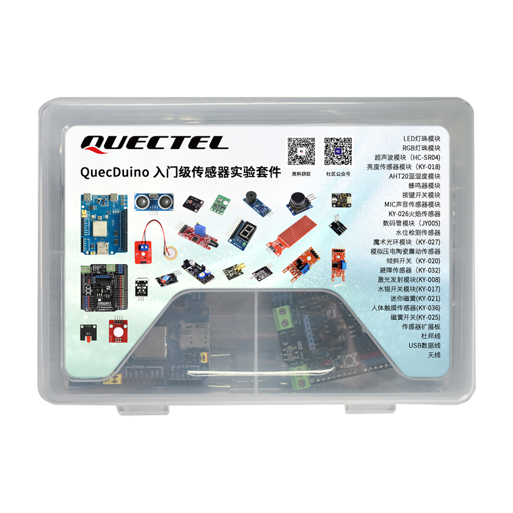

这是一款由EG800Z系列QuecDuino开发板与二十余种传感器及执行器深度融合打造的入门级实验套件。

QuecDuino入门级传感器实验套件，是专为初学者、创客及教育领域量身定制的一站式开发平台。它完美继承了Arduino开源硬件的易用基因，并创新性地集成了移远通信（Quectel）领先的蜂窝网络技术，让您的物联网构想摆脱繁琐配置，轻松照进现实。

**产品特点**

- **物联网开发**：不同于传统的 Arduino Uno，本套件内置网络通信能力，让你写的代码可以直接连接互联网，无需依赖电脑或额外的 WiFi 模块。
- **工业级稳定性**：采用移远通信 (Quectel) 工业级模组，适应 -35℃ 到 85℃ 的宽温工作环境，不仅适合学习，也适合工业原型验证。
- **传感器丰富**：多达数十种传感器外设供用户学习使用，丰富的硬件组合能完美还原真实的物联网开发需求。

> !! 本仓库收录 QuecDuino 入门级传感器实验套件搭配使用的基于 UniRTOS 开发平台的实验案例。
>
> 更多关于 UniRTOS 平台开发方式，请访问 [UniRTOS文档中心](https://www.quectel.com.cn/unirtos/docs?docs_page=index.html)

### **案例清单**

|      | Module                                                       | 描述                                                         |
| ---- | ------------------------------------------------------------ | ------------------------------------------------------------ |
| 01   | [LED Module](example/01-led/README.md)                       | 基础 IO 输出控制案例，通过高低电平实现 LED 亮灭，是嵌入式入门最基础的数字输出实践。 |
| 02   | [Single Button Module](example/02-key_interrupt/README.md)   | 基础 IO 输入检测案例，实现按键按下 / 松开逻辑，学习按键状态识别。 |
| 03   | [RGB LED Module](example/03-rgb_led/README.md)               | 实现红 / 绿 / 蓝三原色混色。                                 |
| 04   | [Microphone (MIC) Module](example/04-mic/README.md)          | 检测周围环境中的声音强度。                                   |
| 05   | [Buzzer Module](example/05-buzzer/README.md)                 | 蜂鸣器控制案例，可实现固定音调提示音。                       |
| 06   | [Water Level Detection Module](example/06-water_level_detect/README.md) | 电阻式液体检测传感器，检测水位高度、有无水、漏水报警等场景。 |
| 07   | [Reed Switch Module (KY-025)](example/07-magnetic_reed_switch(KY-025)/README.md) | 干簧管磁感应开关，靠近磁铁时触发通断信号。                   |
| 08   | [Obstacle Detection Module (KY-032)](example/08-Obstacle_Detection_Module(KY-032)/README.md) | 障碍物检测模块是红外反射式数字检测器件，也叫红外避障模块，用于近距离障碍物检测、循迹、避障、限位触发。 |
| 09   | [Mini Reed Switch (KY-021)](example/09-Mini_Magnetic(KY-021)/README.md) | 迷你磁簧，全称迷你磁簧开关（干簧管模块），是一种利用磁场控制通断的无源开关组件，这类磁性感应器件一般作为门磁检测、位置检测、限位触发使用。 |
| 10   | [Photoresistor Module (KY-018)](example/10-photoresistor(KY-018)/README.md) | 光敏电阻传感器是一种能够将光信号转换为电信号的传感器，其阻值会随着光照强度的变化而改变。 |
| 11   | [Flame Detection Module (KY-026)](example/11-flame_detect(KY-026)/README.md) | 火焰检测模块是用于探测火焰 / 明火的传感器模块，通过接收火焰产生的红外光，输出高低电平信号，实现火灾报警、火源检测。 |
| 12   | [Magic Light Cup Module (KY-027)](example/12-Magic_Aura_Module(KY-027)/README.md) | 魔术光环模块（KY‑027）是倾斜感应 + LED 发光二合一数字模块，内置水银开关与高亮 LED，用于倾斜检测、姿态触发、状态指示、创客互动项目。 |
| 13   | [Tilt Switch Module (KY-020)](example/13-Inclination_switch_module(KY-020)/README.md) | 倾斜开关是姿态感应数字开关器件，也被称作滚珠开关、倾倒传感器，常用于倾斜检测、防倒保护、姿态触发、智能报警场景。 |
| 14   | [Ultrasonic Module (HC-SR04)](example/14-Ultrasonic_module(HC-SR04)/README.md) | 基于声波反射的距离测量传感器，通过发射与接收超声波计算物体距离，常用于小车测距、障碍物检测、液位 / 水位测量场景。 |
| 15   | [Human Touch Module (KY-036)](example/15-Human_body_touch_module(KY-036)/README.md) | 电容式触摸检测传感器，通过人体触碰改变电容信号，实现触摸开关、触摸按键功能，替代传统机械按键提升交互体验。 |
| 16   | [Digital Tube Module (JY005)](example/16-Digital_tube_module(JY005)/README.md) | 单位数码管模块是数字显示器件，由 7 段发光二极管组成，用于显示 0-9 数字及简单符号，广泛用于计数、计时、状态显示、创客 DIY 场景。 |
| 17   | [Laser Transmitter Module (KY-008)](example/17-Laser_emission_module(KY-008)/README.md) | 激光发射模块通过半导体激光二极管，将电能高效转化为激光发射出去。它广泛用于激光测距、激光雷达、光纤通信、激光指示、红外夜视等场景。 |
| 18   | [Mercury Switch Module (KY-017)](example/18-Mercury_switch_module(KY-017)/README.md) | 水银开关模块，常用于倾斜报警、防倒保护、姿态检测、触发控制场景。 |
| 19   | [Temperature & Humidity Sensor (AHT20)](example/19-temperature_and_humidity_sensor(AHT20)/README.md) | 温湿度传感器作为常见的传感器之一，是一种装有湿敏和热敏元件，能够用来测量温度和湿度的传感器装置。 |
| 20   | [Analog Piezoelectric Vibration Sensor](example/20-Simulated_Piezoelectric_Ceramic_Vibration_Sensor/README.md) | 模拟压电陶瓷震动传感器是一款用于检测振动、碰撞或者声波的传感器模块。它使用压电陶瓷技术，能够在受到压力或震动时输出相应的模拟信号。 |

# EG800Z Duino 开发板使用指导

## **硬件准备**

- 一块移远通信提供的pico开发板 (下文以该开发板为例)。
- **USB数据线**（USB-A转USB-C）。
- **PC** (Windows)。

## **软件准备**

- **unirtos-toolchain.exe**：编译工具链安装程序，[点此获取](https://www.quectel.com.cn/download/unirtos-交叉编译工具链)。
- **Python**：用于运行unirtos-cli工具，版本要求3.9及更高版本。
- **Git**：unirtos-cli使用该工具拉取SDK、库源码等，版本要求2.20及更高版本。
- **unirtos-cli**：UniRTOS的命令行工具，用于一键拉取SDK、快速创建工程。
- **USB驱动**：用于PC识别模块的USB枚举口，[点此获取](https://www.quectel.com.cn/download/quectel_windows_usb_drivery_v1-0_cn)。
- *QFlash.exe**：模块固件烧录程序，用于烧录UniRTOS编译生成的固件，[点此获取](https://www.quectel.com.cn/download/qflash_v7-9_cn)。
- **EPAT工具**：芯片厂商提供的日志捕获工具，用于查看模块运行日志以分析应用程序执行情况，[点此获取](https://www.quectel.com.cn/download/epat日志工具)。
- **QCOM工具**：移远通信提供的COM口工具程序，用于执行和验证AT命令，[点此获取](https://www.quectel.com.cn/download/qcom_v1-8_cn)。

在固件编译烧录前需要保证软件环境配置完成，参考[快速上手](https://www.quectel.com.cn/unirtos/docs?docs_page=快速上手/快速上手.html)。

# 创建第一个应用-helloworld

## 查看远程Demo

### 执行命令

打开一个新的PowerShell窗口，执行以下命令：

```PowerShell
unirtos-cli ls-demos
```

执行结果如图：

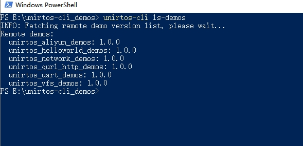

### **命令格式与参数说明**

```PowerShell
unirtos-cli ls-demos [-f] [-j] [-d <project-dir>]
```

- **功能描述**：输出出远程Demo及其版本列表。
- **参数说明**：

| 参数                | 说明                                                         |
| :------------------ | :----------------------------------------------------------- |
| *-f, --force*       | 强制更新*<unirtos_root>/demos/manifests*（忽略1小时更新间隔） |
| *-j, --json-output* | 添加该参数后，结果将以JSON格式输出                           |
| *-d, --project-dir* | 起始目录。命令会从该目录开始，向上逐级查找*env_config.json*配置文件；如果找到，则使用其中定义的**unirtos_root**路径，否则使用默认路径*~/.unirtos*。 |

## 创建helloworld新工程

### 执行命令

继续在PowerShell窗口执行以下命令：

```PowerShell
unirtos-cli new -r unirtos_helloworld_demos -d E:\unirtos-cli_demos
```

执行完成后，工具将自动从官方Demo仓库下载[helloworld示例](https://github.com/UniRTOS/unirtos_helloworld_demos)，并生成新的项目工程。

执行结果如图：

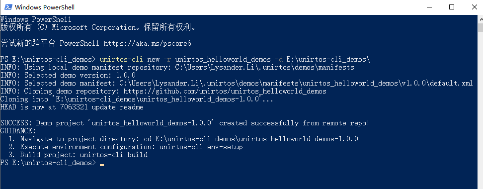

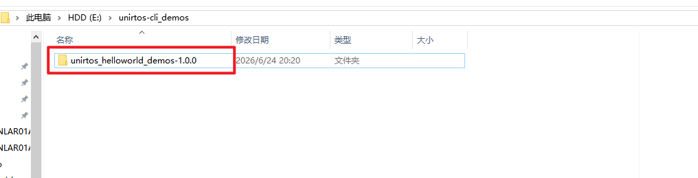

### **命令格式与参数说明**

```PowerShell
unirtos-cli new [-r] <project-name> [-v <version>] [-d <project-dir>] [-f]
```

- **功能描述**：创建一个新的项目，支持两种模式：一种是基于模板创建，另一种是直接基于现有Demo创建。
- **参数说明**：

| 参数                | 默认值        | 说明                                                         |
| :------------------ | :------------ | :----------------------------------------------------------- |
| *project-name*      | 必填          | 项目名称（仅限名称，不可包含路径分隔符），不能与`-r`参数同时使用 |
| *-r, --from-demo*   | 关闭          | 基于远程已有的 Demo 创建项目                                 |
| *-v, --version*     | 省略          | 指定远程Demo的版本（支持 1.0.0、v1.0.0 等格式）。该参数仅可与参数`-r`同时使用；省略时自动选用最新版本 |
| *-d, --project-dir* | .（当前目录） | 指定项目基目录。项目最终会创建在*<project-dir>/<project-name>*路径下 |
| *-f, --force*       | 关闭          | 强制更新*<unirtos_root>/demos/manifests*后再基于Demo创建。该参数仅可与`-r`同时使用 |

## 初始化工程环境

### 执行命令

打开PowerShell窗口，进入创建的**工程目录**（`unirtos-cli new`命令`-d`参数携带的路径），执行以下命令：

```PowerShell
unirtos-cli env-setup
```

执行命令后，unirtos-cli会根据*env_config.json*的默认配置从远程拉取SDK到本地，默认存放路径为`C:\Users\<用户名>\.unirtos`。后续拉取相同版本时，将直接复用本地已缓存的SDK，无需再次从远程下载。

命令执行结果如图：

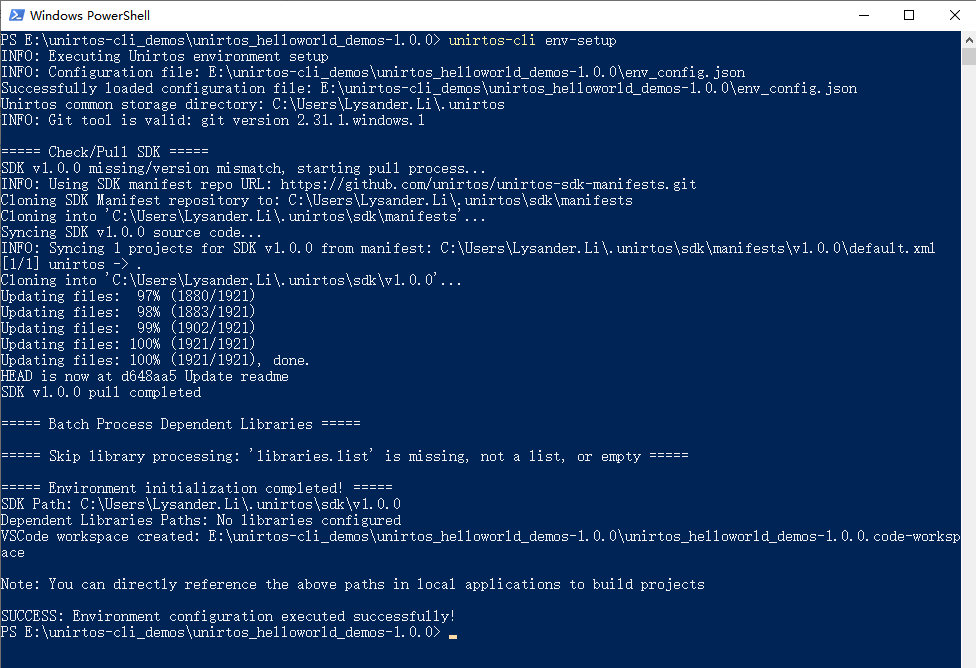

### 命令格式与参数说明

```PowerShell
unirtos-cli env-setup [-d <project-dir>]
```

- **功能描述**：根据*env_config.json*的配置，拉取指定版本的SDK和所有依赖库到本地存储目录。
- **参数说明**：

| 参数                | 默认值        | 说明                            |
| :------------------ | :------------ | :------------------------------ |
| *-d, --project-dir* | .（当前目录） | 包含*env_config.json*的项目目录 |

## 使用VS Code打开工程

环境拉取完成后，项目目录下会自动生成一个VS Code工作区文件。双击打开该文件，工作区将同时包含当前项目及拉取的SDK，方便使用VS Code开发时直接查看SDK中的函数头文件、附加组件等内容。

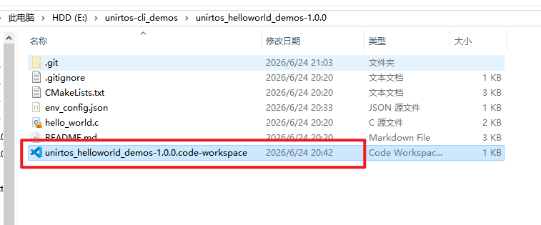

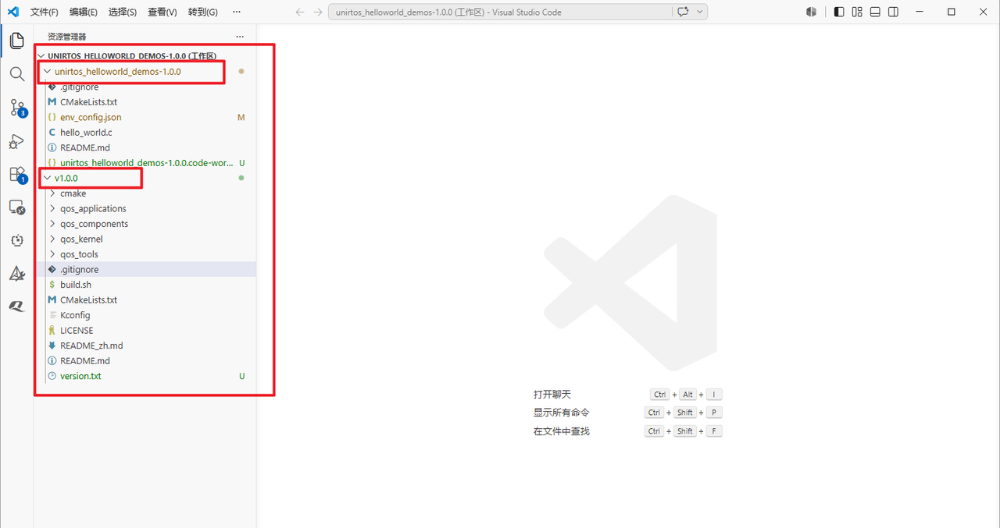


# 编译固件

## 工程目录结构

### 进入工程目录

进入新创建的工程所在目录。如图：

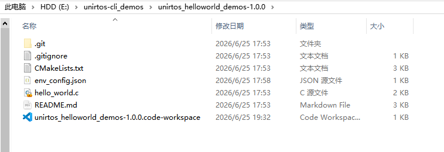

### **目录结构说明**

```Plain
unirtos_helloworld_demos-1.0.0/
├── CMakeLists.txt                       // CMake构建脚本
├── env_config.json                      // unirtos-cli使用的环境配置文件
├── hello_world.c                        // 应用源代码
├── README.md                            // 应用说明文档
└── unirtos_hel....code-WorkSpeace       // VS Code项目工作区文件
```

## SDK目录结构

### SDK存放路径

默认路径为*C:\Users\ <用户名> \ .unirtos*，拉取的SDK位于该路径下的“**sdk**”目录。如图为1.0.1版SDK：

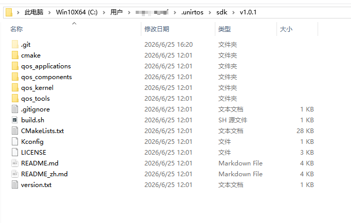

### **目录结构说明**

```Plain
目录树：
├─cmake                        // CMake相关配置文件
├─qos_applications/            // 用于存放应用示例于业务代码
│  ├─app_init                  // App层初始化相关文件
│  └─unirtos_std               // AT侧相关功能
├─qos_components/              // 系统组件与中间件
│  ├── components/             // 可裁剪功能组件
│  └── system/                 // 系统服务、驱动、协议栈
├─qos_kernel/                  // 存放平台内核适配相关工程
│  └── eigen_718/              // 典型平台适配
└─qos_tools                    // 编译及调试工具
│  └── python/                 // 构建/配置/打包 Python工具
├─build.sh                     // 一键构建脚本
├─CMakeLists.txt               // UniRTOS编译的主CMake工程文件
├─Kconfig                      // 主配置入口，管理宏控依赖及约束条件
└──...
```

## 编译固件

### 执行命令

如果实际使用非EG800ZCN_LA模组，需要修改编译其他实际使用的型号，如“EC800ZCN_LF”。当前指定编译EG800ZCN_LA固件，在工程目录下打开powershell窗口，输入命令：

```PowerShell
unirtos-cli build -m EG800ZCN_LA -v EG800ZCNLAR01A01_OCPU_20260625
```

在PowerShell窗口执行固件编译命令，等待编译结束后，在日志末尾会提示固件编译结果，编译成功如图所示：

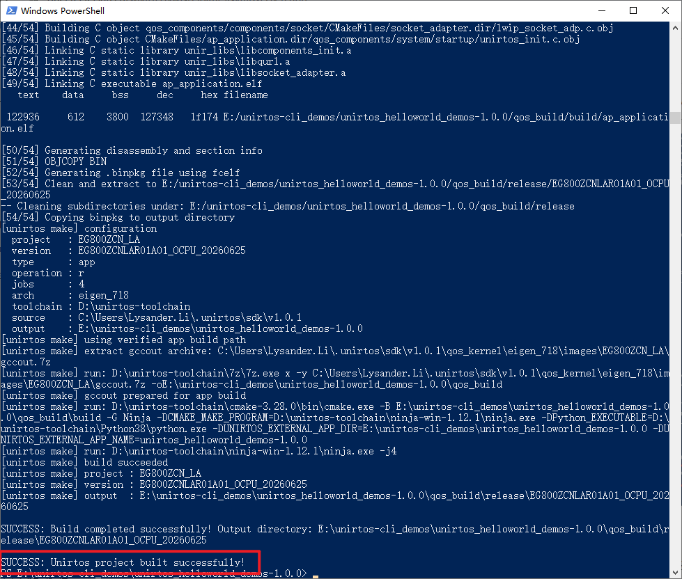

### 命令格式与参数说明

```PowerShell
unirtos-cli build [-d <project-dir>] [-j <jobs>] [-m <module>] [-v <version>]
```

- **功能描述**：调用UniRTOS工具链编译当前外部应用。
- **参数说明**：

| 参数                | 默认值                  | 优先级                                          | 说明                     |
| :------------------ | :---------------------- | :---------------------------------------------- | :----------------------- |
| *-d, --project-dir* | .（当前命令执行路径）   | —                                               | 项目目录                 |
| *-j, --jobs*        | 4                       | CLI > env_config.build.jobs > 4                 | 并行编译线程数           |
| *-m, --module*      | env_config.build.module | CLI > env_config.build.module                   | 模块名，例如 EG800ZCN_LA |
| *-v, --version*     | 应用根目录名称          | CLI > env_config.build.version > 应用根目录名称 | 固件版本字符串           |

### 固件输出路径

固件包输出路径位于项目目录的“*qos_build\release*”路径下。

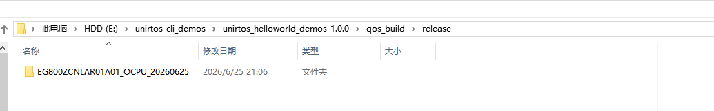


# 烧录固件

## 打开QFlash工具

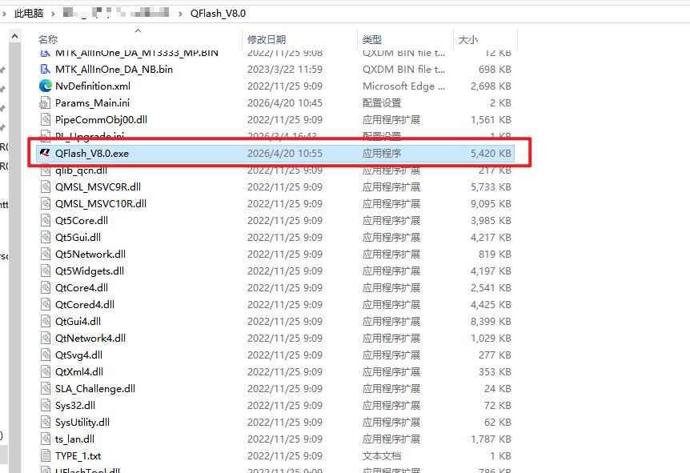

## QFlash选择固件

打开QFlash程序，点击“**Load FW Files**”：

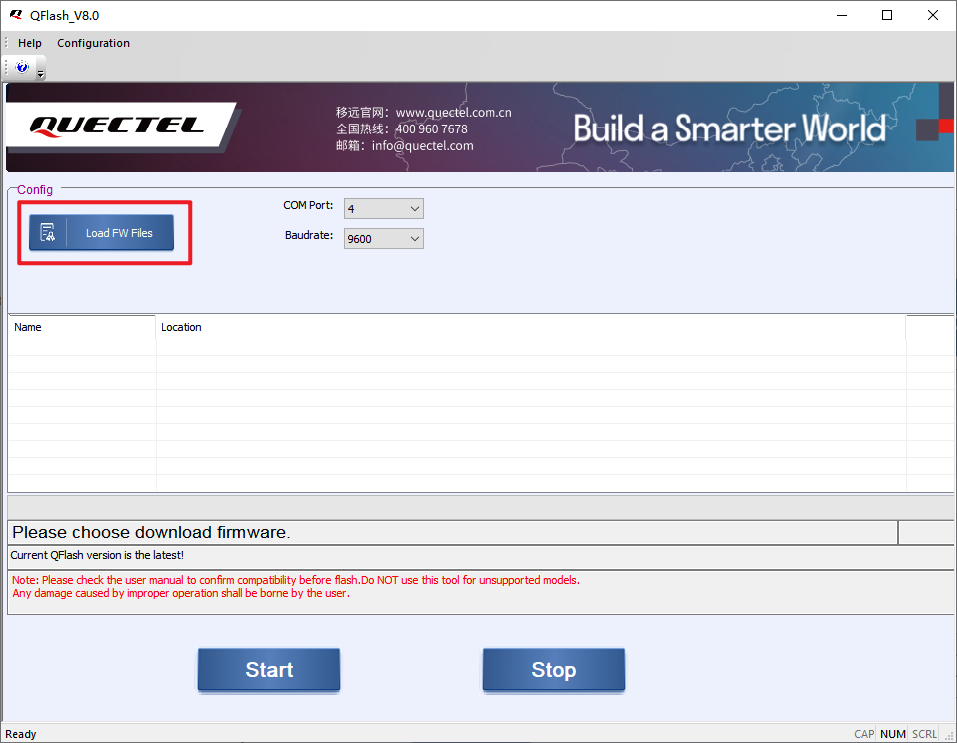

## 选择固件包

选择对应工程目录下*qos_build\release*文件夹中的*.hbinpkg*文件。

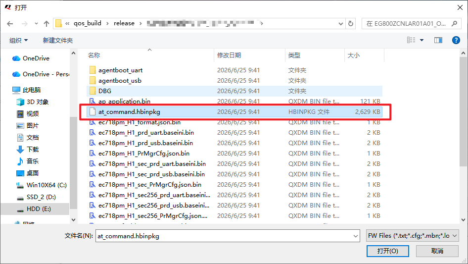

## 打开电脑设备管理器

设备长按电源键开机，打开设备管理器，查看“端口 (COM和LPT)”中的Quectel USB AT Port，记录COM通道号：

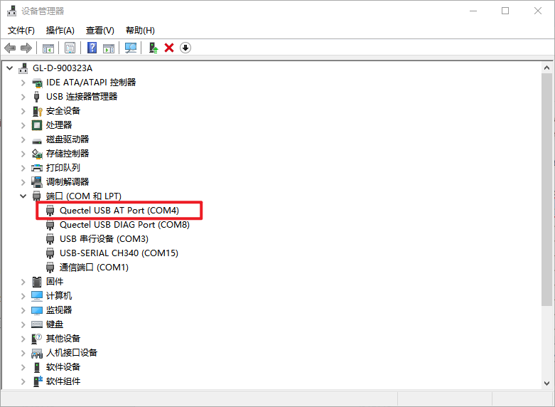

## QFlash选择对应AT COM口

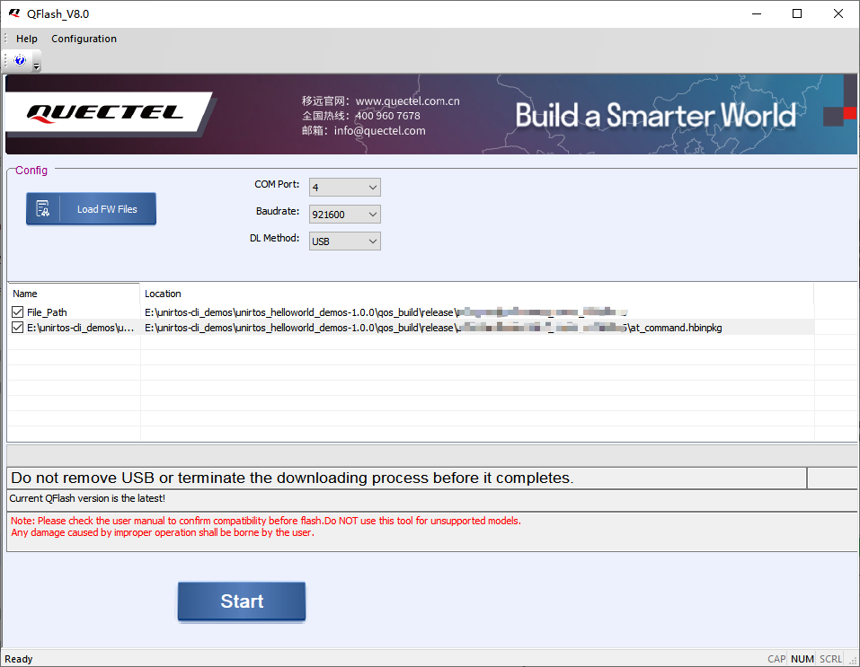

## 确认是否烧录成功

打开QCOM，选择AT口(通过设备管理器查看)，输入“**AT**”，验证固件是否烧录成功，回复“**OK**”表示成功。

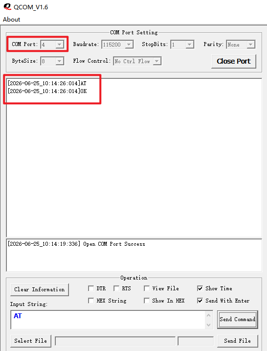


# 日志调试

## 打开EPAT

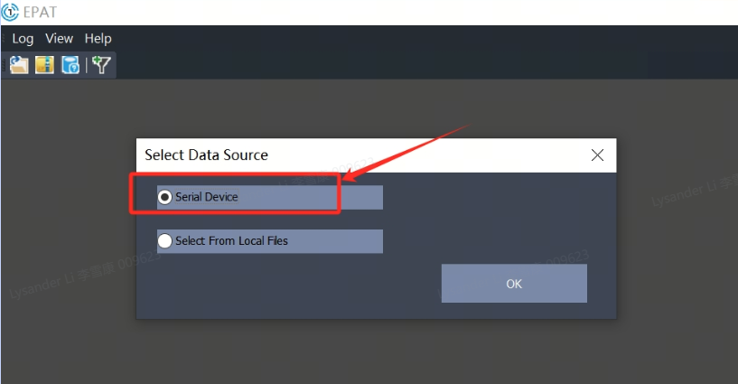

## 连接设备

点击“**Device Communication**”，选择串口设备并点击“**打开**”：

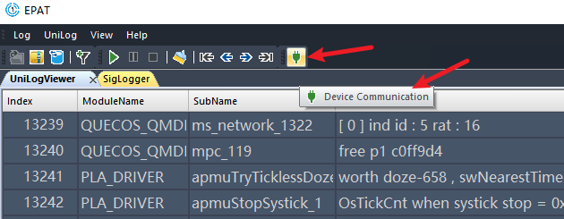

选择设备管理器中的**Quectel USB DIAG Port**通道，点击“**OK**”查看日志输出：

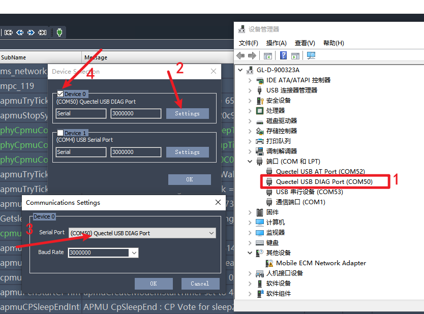

## 日志数据库匹配

点击“**Database State**”，选择数据库文件以匹配日志数据库：

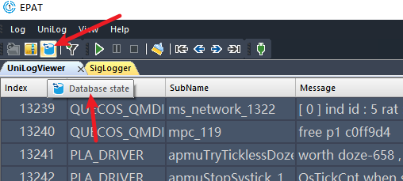

选择*qos_build\release*自定义版本文件夹下的*DBG/comdb.txt*文件，点击“**Update**”：

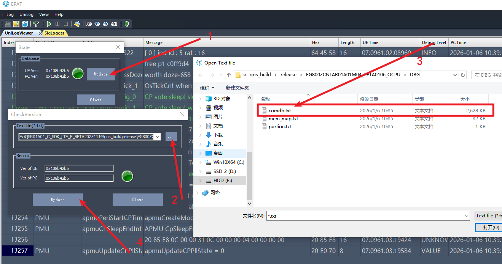

## 暂停日志输出

在“**UniLogViewer**”选项卡，点击“**Stop**”停止日志记录：

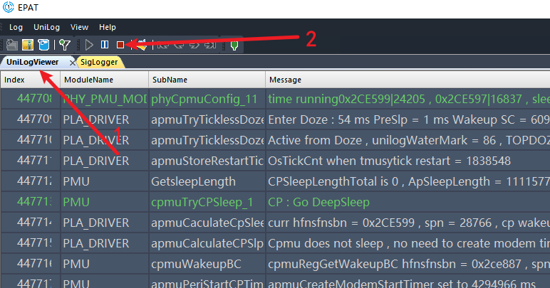

## app日志搜索

使用“**Ctrl+F**”搜索“**hello world**”，点击“**Find Previous**”查看**hello world**程序日志：

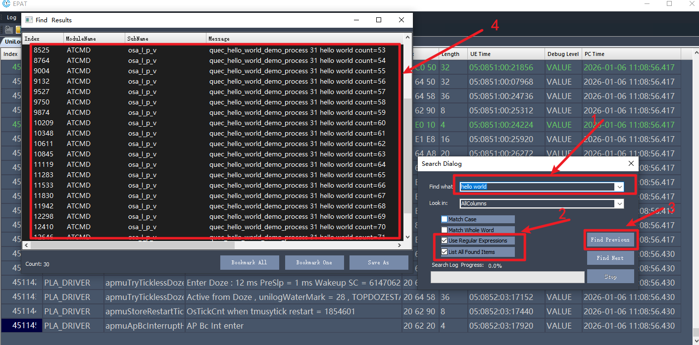

## 论坛社区

[点此进入](https://forumschinese.quectel.com/c/66-category/66)

## 贡献指南

欢迎参与共建，建议按以下方式提交：

- 提交前先执行一次基础验证：env-setup、build、clean。
- 使用清晰的提交说明，描述改动目的、影响范围和验证结果。
- 新增功能或行为变化时，同步更新 README 与相关文档。
- 通过 Issue 或 Pull Request 提交问题修复与功能改进。