# QuecDuino Starter Sensor Experiment Kit

### Product Introduction

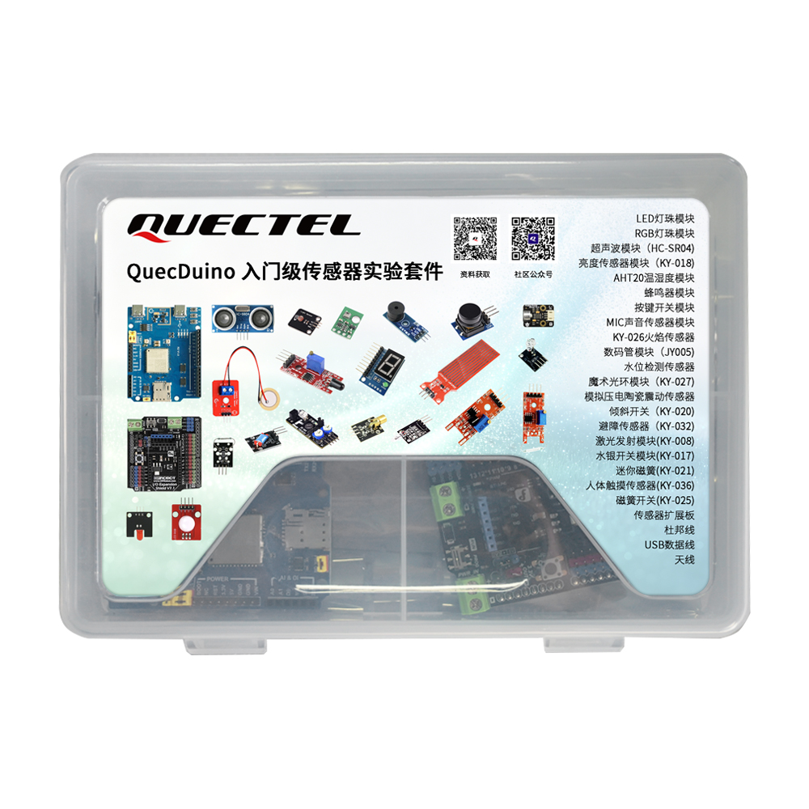

This starter kit combines the EG800Z series QuecDuino development board with more than twenty sensors and actuators.

The QuecDuino Starter Sensor Experiment Kit is an all-in-one development platform designed for beginners, makers, and educational use. It inherits the ease of use of the Arduino open-source hardware ecosystem and integrates Quectel's cellular connectivity technology, making it easier to turn IoT ideas into working products without complex setup.

Product features:

- IoT-ready development: Unlike a traditional Arduino Uno, this kit includes built-in network connectivity so your code can access the Internet directly without relying on a PC or an additional Wi-Fi module.
- Industrial-grade stability: Built on a Quectel industrial-grade module, it supports a wide operating temperature range from -35 degrees C to 85 degrees C, making it suitable for both learning and industrial prototype validation.
- Rich sensor ecosystem: The kit includes dozens of sensor peripherals for learning and experimentation, with hardware combinations that map well to real IoT development scenarios.

> This repository contains UniRTOS-based demo projects for the QuecDuino Starter Sensor Experiment Kit.
>
> For more information about development on the UniRTOS platform, visit the [UniRTOS Documentation Center](https://www.quectel.com.cn/unirtos/docs?docs_page=index.html).

### Demo List

| No. | Module | Description |
| ---- | ---- | ---- |
| 01 | [LED Module](example/01_led/README_EN.md) | Basic GPIO output control example. It uses high and low levels to turn the LED on and off, making it a fundamental digital output practice for embedded beginners. |
| 02 | [Single Button Module](example/02_key_interrupt/README_EN.md) | Basic GPIO input detection example for button press and release handling, suitable for learning button state recognition. |
| 03 | [RGB LED Module](example/03_rgb_led/README_EN.md) | Demonstrates red, green, and blue color mixing. |
| 04 | [Microphone (MIC) Module](example/04_mic/README_EN.md) | Detects ambient sound intensity. |
| 05 | [Buzzer Module](example/05_buzzer/README_EN.md) | Buzzer control example for simple fixed-tone alert sounds. |
| 06 | [Water Level Detection Module](example/06_water_level_detect/README_EN.md) | Resistive liquid detection sensor for water level measurement, water presence detection, and leakage alarm scenarios. |
| 07 | [Reed Switch Module (KY-025)](example/07_magnetic_reed_switch/README_EN.md) | Magnetic reed switch that triggers an on/off signal when a magnet approaches. |
| 08 | [Obstacle Detection Module (KY-032)](example/08_Obstacle_Detection_Module/README_EN.md) | Infrared reflective digital detection module for short-range obstacle detection, line tracking, obstacle avoidance, and limit triggering. |
| 09 | [Mini Reed Switch (KY-021)](example/09_Mini_Magnetic/README_EN.md) | Mini magnetic reed switch module, a passive switch controlled by a magnetic field, commonly used for door contact detection, position sensing, and limit triggering. |
| 10 | [Photoresistor Module (KY-018)](example/10_photoresistor/README_EN.md) | Light-dependent resistor sensor that converts light intensity changes into electrical signal changes through resistance variation. |
| 11 | [Flame Detection Module (KY-026)](example/11_flame_detect/README_EN.md) | Detects flames or open fire by sensing infrared light emitted by a flame and outputting a digital level for fire alarms and fire source detection. |
| 12 | [Magic Light Cup Module (KY-027)](example/12_Magic_Aura_Module/README_EN.md) | Combined tilt-sensing and LED module with a built-in mercury switch and bright LED, suitable for tilt detection, posture-triggered interaction, and status indication. |
| 13 | [Tilt Switch Module (KY-020)](example/13_Inclination_switch_module/README_EN.md) | Posture-sensing digital switch, also known as a ball switch or tilt sensor, commonly used for tilt detection, anti-tip protection, posture triggering, and alarms. |
| 14 | [Ultrasonic Module (HC-SR04)](example/14_Ultrasonic_module/README_EN.md) | Distance measurement sensor based on ultrasonic reflection, often used for mobile robot ranging, obstacle detection, and liquid level measurement. |
| 15 | [Human Touch Module (KY-036)](example/15_Human_body_touch_module/README_EN.md) | Capacitive touch sensor that detects contact by changes in capacitance, enabling touch switch and touch key functionality as a replacement for mechanical buttons. |
| 16 | [Digital Tube Module (JY005)](example/16_Digital_tube_module/README_EN.md) | Single-digit seven-segment display module for showing digits 0-9 and simple symbols, widely used for counting, timing, status display, and maker projects. |
| 17 | [Laser Transmitter Module (KY-008)](example/17_Laser_emission_module/README_EN.md) | Semiconductor laser transmission module that efficiently converts electrical energy into laser output for applications such as ranging, lidar, optical communication, and laser indication. |
| 18 | [Mercury Switch Module (KY-017)](example/18_Mercury_switch_module/README_EN.md) | Mercury switch module commonly used for tilt alarms, anti-tip protection, posture detection, and trigger control. |
| 19 | [Temperature & Humidity Sensor (AHT20)](example/19_temperature_and_humidity_sensor/README_EN.md) | Temperature and humidity sensor module equipped with humidity-sensitive and thermal-sensitive elements for measuring environmental temperature and humidity. |
| 20 | [Analog Piezoelectric Vibration Sensor](example/20_piezo_vibration_sensor/README_EN.md) | Analog piezoelectric ceramic vibration sensor module for detecting vibration, impact, or sound waves by outputting a corresponding analog signal under pressure or vibration. |

# EG800Z Duino Development Board Firmware Flashing and Usage Guide

## Hardware Preparation

- A Quectel Pico development board. The examples below use this board as the reference platform.
- A USB data cable (USB-A to USB-C).
- A Windows PC.

## Software Preparation

- unirtos-toolchain.exe: Toolchain installer for compilation. [Download here](https://www.quectel.com.cn/download/unirtos-%E4%BA%A4%E5%8F%89%E7%BC%96%E8%AF%91%E5%B7%A5%E5%85%B7%E9%93%BE).
- Python: Required for running unirtos-cli. Version 3.9 or later is recommended.
- Git: Used by unirtos-cli to pull the SDK and library source code. Version 2.20 or later is recommended.
- unirtos-cli: The UniRTOS command-line tool for pulling the SDK and quickly creating projects.
- USB driver: Required for the PC to recognize the module's USB ports. [Download here](https://www.quectel.com.cn/download/quectel_windows_usb_drivery_v1-0_cn).
- QFlash.exe: Firmware flashing tool for downloading UniRTOS-generated firmware to the module. [Download here](https://www.quectel.com.cn/download/qflash_v7-9_cn).
- EPAT tool: Log capture tool provided by the chipset vendor, used to inspect module runtime logs and analyze application behavior. [Download here](https://www.quectel.com.cn/download/epat%E6%97%A5%E5%BF%97%E5%B7%A5%E5%85%B7).
- QCOM tool: COM port utility provided by Quectel for sending and verifying AT commands. [Download here](https://www.quectel.com.cn/download/qcom_v1-8_cn).

Before building and flashing firmware, make sure the software environment is fully configured. Refer to the [UniRTOS Quick Start](https://www.quectel.com.cn/unirtos/docs?docs_page=%E5%BF%AB%E9%80%9F%E4%B8%8A%E6%89%8B/%E5%BF%AB%E9%80%9F%E4%B8%8A%E6%89%8B.html).

# Create Your First Application: helloworld

## View Remote Demos

### Run the Command

Open a new PowerShell window and run:

```PowerShell
unirtos-cli ls-demos
```

The output is shown below:

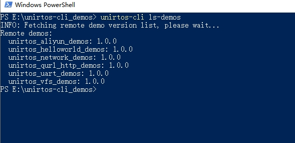

### Command Syntax and Parameters

```PowerShell
unirtos-cli ls-demos [-f] [-j] [-d <project-dir>]
```

- Function: Outputs the list of remote demos and their available versions.
- Parameters:

| Parameter | Description |
| :------------------ | :----------------------------------------------------------- |
| -f, --force | Force an update of <unirtos_root>/demos/manifests without waiting for the default 1-hour update interval. |
| -j, --json-output | Output the result in JSON format. |
| -d, --project-dir | Starting directory. The command searches upward from this directory for env_config.json. If found, it uses the unirtos_root path defined there; otherwise it uses the default path ~/.unirtos. |

## Create a New helloworld Project

### Run the Command

Continue in the PowerShell window and run:

```PowerShell
unirtos-cli new -r unirtos_helloworld_demos -d E:\unirtos_demos
```

After the command completes, the tool automatically downloads the [helloworld example](https://github.com/UniRTOS/unirtos_helloworld_demos) from the official demo repository and creates a new project.

The output is shown below:

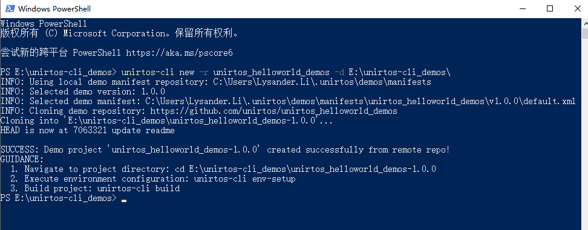

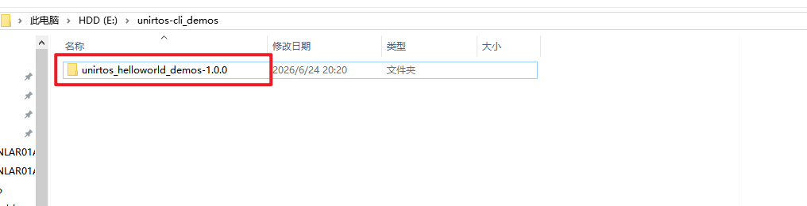

### Command Syntax and Parameters

```PowerShell
unirtos-cli new [-r] <project-name> [-v <version>] [-d <project-dir>] [-f]
```

- Function: Creates a new project. Two modes are supported: create from a template, or create directly from an existing remote demo.
- Parameters:

| Parameter | Default | Description |
| :------------------ | :------------ | :----------------------------------------------------------- |
| project-name | Required | Project name only. Path separators are not allowed. This option cannot be used together with -r. |
| -r, --from-demo | Disabled | Create a project from an existing remote demo. |
| -v, --version | Omitted | Specify the version of the remote demo. Formats such as 1.0.0 and v1.0.0 are supported. This option can only be used together with -r. If omitted, the latest version is used automatically. |
| -d, --project-dir | . (current directory) | Specify the base directory for the project. The final project path will be <project-dir>/<project-name>. |
| -f, --force | Disabled | Force an update of <unirtos_root>/demos/manifests before creating the project from a demo. This option can only be used together with -r. |

## Initialize the Project Environment

### Run the Command

Open a PowerShell window, enter the created project directory, which is the path specified by the -d option in the unirtos-cli new command, and run:

```PowerShell
unirtos-cli env-setup
```

After execution, unirtos-cli pulls the SDK from the remote source to the local machine based on the default configuration in env_config.json. By default, the SDK is stored at C:\Users\<username>\.unirtos. When the same SDK version is required later, the locally cached copy is reused and does not need to be downloaded again.

The output is shown below:

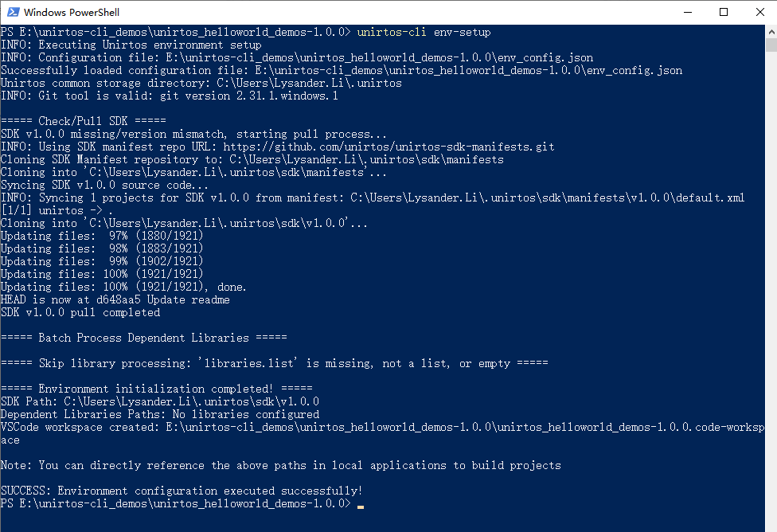

### Command Syntax and Parameters

```PowerShell
unirtos-cli env-setup [-d <project-dir>]
```

- Function: Pull the specified SDK version and all required dependencies to the local storage directory according to env_config.json.
- Parameters:

| Parameter | Default | Description |
| :------------------ | :------------ | :------------------------------ |
| -d, --project-dir | . (current directory) | Project directory containing env_config.json. |

## Open the Project in VS Code

After the environment has been prepared, a VS Code workspace file is automatically generated in the project directory. Open this file to load both the current project and the downloaded SDK into the same workspace, which makes it easier to inspect SDK headers and related components during development.

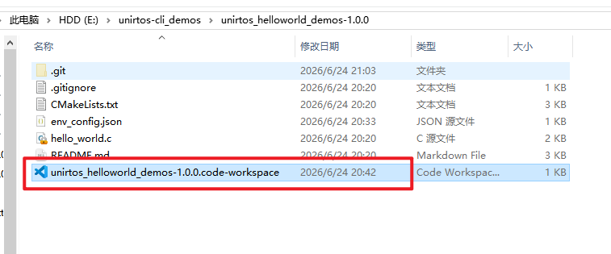

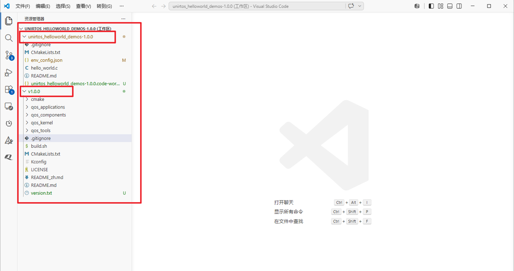

# Build Firmware

## Project Directory Structure

### Enter the Project Directory

Go to the directory of the newly created project, as shown below:

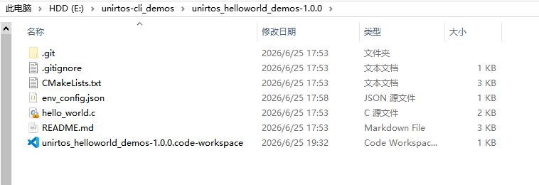

### Directory Structure Description

```Plain
unirtos_helloworld_demos-1.0.0/
├── CMakeLists.txt                       // CMake build script
├── env_config.json                      // Environment configuration file used by unirtos-cli
├── hello_world.c                        // Application source code
├── README.md                            // Application documentation
└── unirtos_hel....code-WorkSpeace       // VS Code workspace file
```

## SDK Directory Structure

### SDK Storage Path

The default path is C:\Users\<username>\.unirtos, and the downloaded SDK is located in the sdk directory under this path. The figure below shows SDK version 1.0.1:

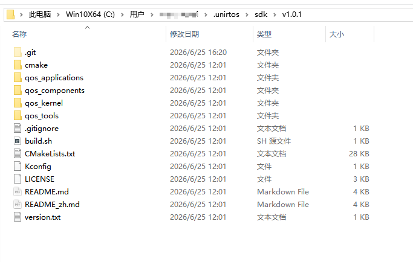

### Directory Structure Description

```Plain
Directory tree:
├─cmake                        // CMake-related configuration files
├─qos_applications/            // Application examples and business logic
│  ├─app_init                  // App-layer initialization files
│  └─unirtos_std               // AT-side related features
├─qos_components/              // System components and middleware
│  ├── components/             // Optional functional components
│  └── system/                 // System services, drivers, and protocol stacks
├─qos_kernel/                  // Platform kernel adaptation projects
│  └── eigen_718/              // Typical platform adaptation
└─qos_tools                    // Build and debugging tools
│  └── python/                 // Python tools for build, configuration, and packaging
├─build.sh                     // One-click build script
├─CMakeLists.txt               // Main UniRTOS CMake project file
├─Kconfig                      // Main configuration entry for macro control dependencies and constraints
└──...
```

## Build the Firmware

### Run the Command

If you are using a module other than EG800ZCN_LA, update the command to match the actual target model, for example EC800ZCN_LF. The following example builds firmware for EG800ZCN_LA. Open a PowerShell window in the project directory and run:

```PowerShell
unirtos-cli build -m EG800ZCN_LA -v EG800ZCNLAR01A01_OCPU_20260625
```

Wait for the build to complete. The end of the log will indicate whether the firmware was built successfully, as shown below:

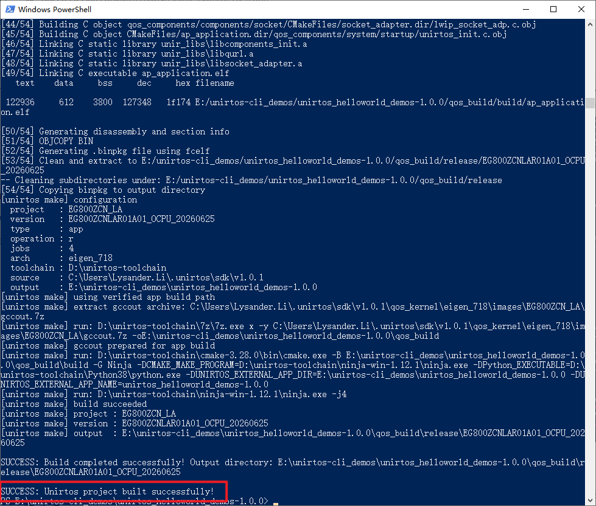

### Command Syntax and Parameters

```PowerShell
unirtos-cli build [-d <project-dir>] [-j <jobs>] [-m <module>] [-v <version>]
```

- Function: Invokes the UniRTOS toolchain to build the current external application.
- Parameters:

| Parameter | Default | Priority | Description |
| :------------------ | :---------------------- | :---------------------------------------------- | :----------------------- |
| -d, --project-dir | . (current command path) | - | Project directory. |
| -j, --jobs | 4 | CLI > env_config.build.jobs > 4 | Number of parallel build jobs. |
| -m, --module | env_config.build.module | CLI > env_config.build.module | Module name, for example EG800ZCN_LA. |
| -v, --version | Application root directory name | CLI > env_config.build.version > application root directory name | Firmware version string. |

### Firmware Output Path

The firmware package is generated under qos_build\release in the project directory.

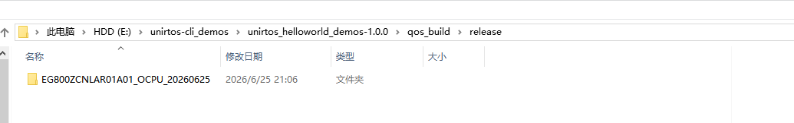

# Flash Firmware

## Open QFlash

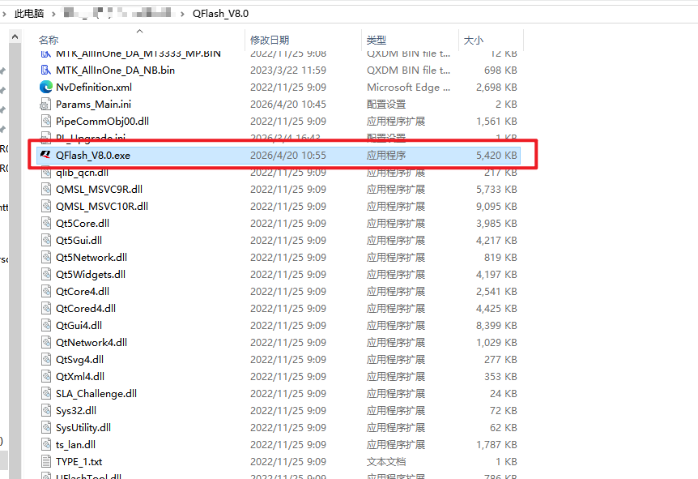

## Select Firmware in QFlash

Open QFlash and click Load FW Files:

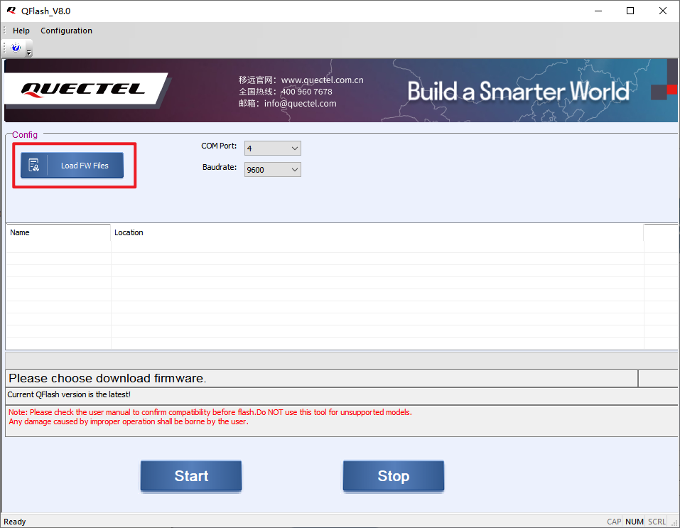

## Select the Firmware Package

Choose the .hbinpkg file from the qos_build\release folder of the corresponding project.

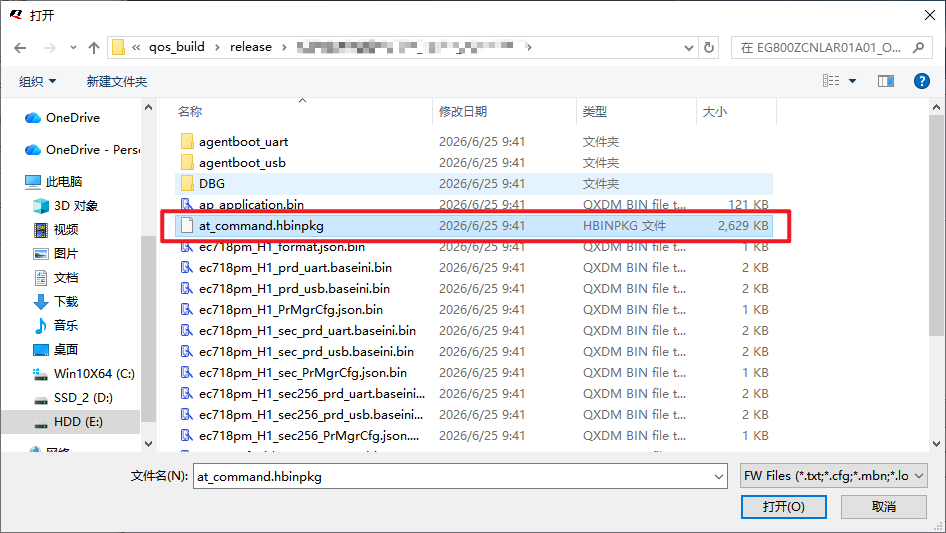

## Open Windows Device Manager

Power on the device by holding the power button, then open Device Manager. Under Ports (COM & LPT), find Quectel USB AT Port and record the COM port number:

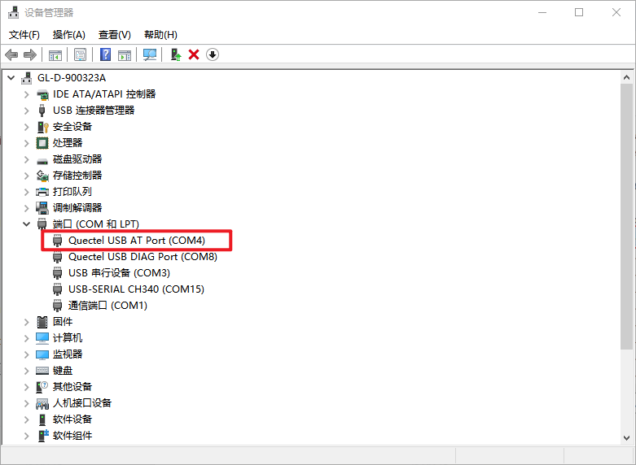

## Select the Corresponding AT COM Port in QFlash

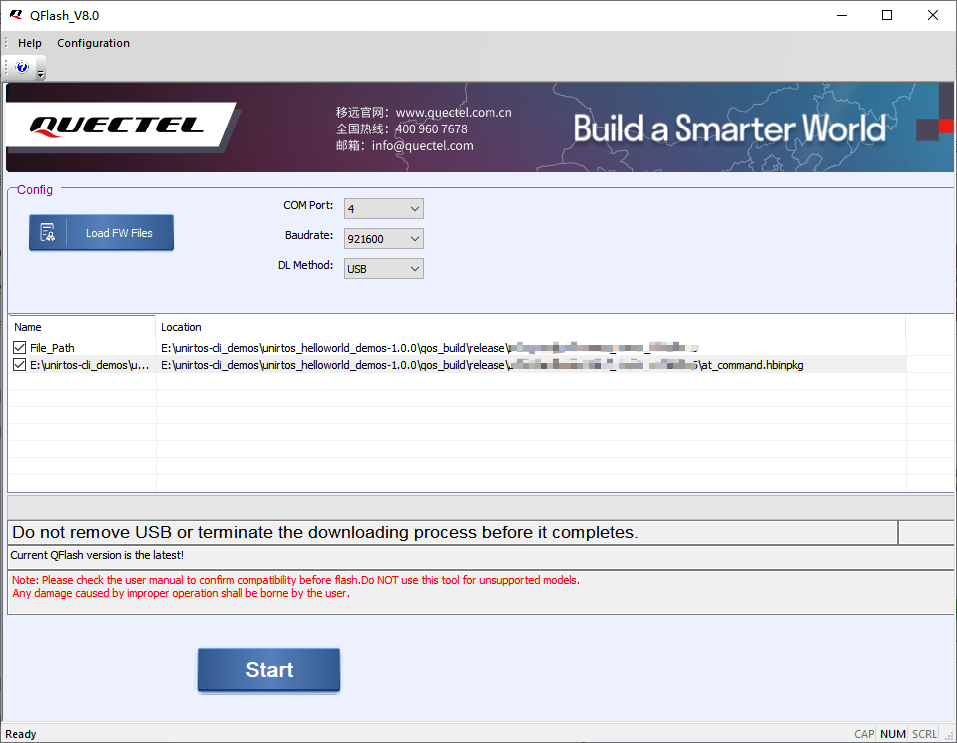

## Confirm That Flashing Succeeded

Open QCOM, select the AT port identified in Device Manager, enter AT, and verify that the firmware responds with OK.

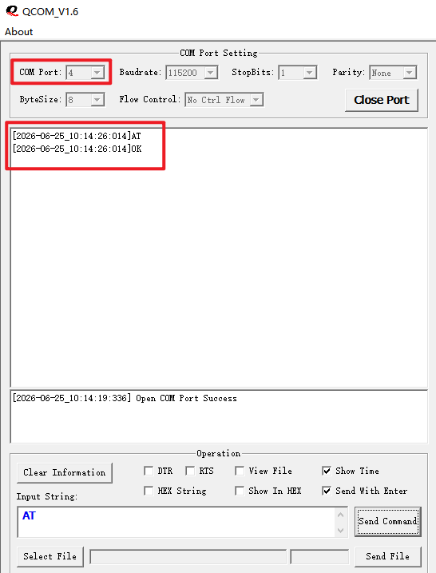

# Log Debugging

## Open EPAT

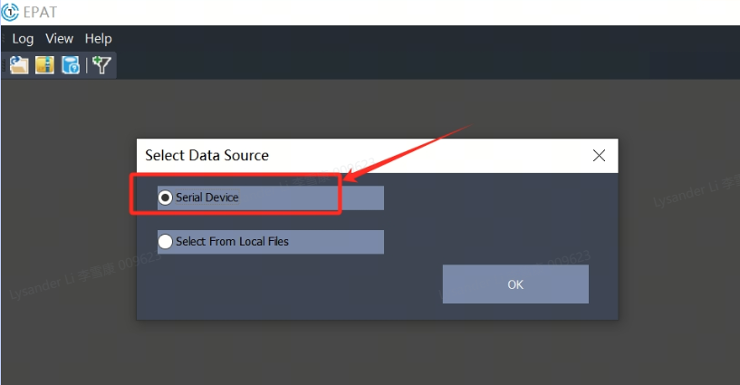

## Connect the Device

Click Device Communication, select the serial device, and click Open:

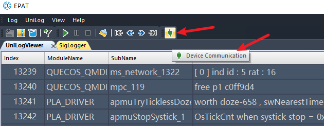

Select the Quectel USB DIAG Port channel shown in Device Manager, then click OK to view the log output:

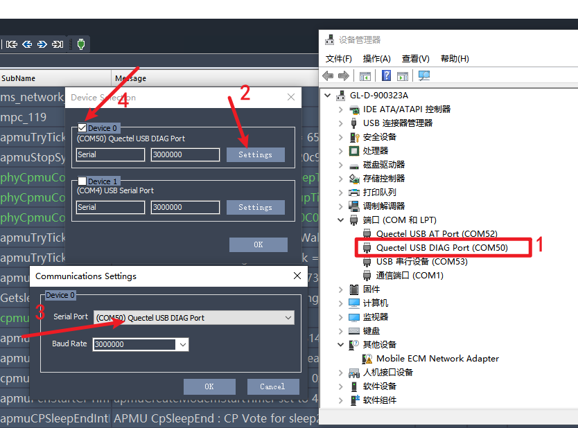

## Match the Log Database

Click Database State and select the database file to match the log database:

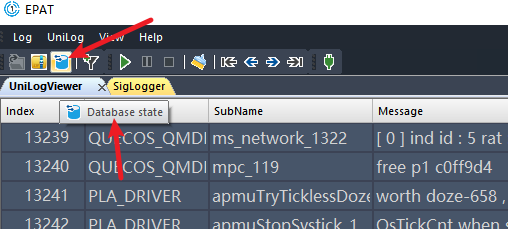

Select the DBG/comdb.txt file from the custom version folder under qos_build\release, then click Update:

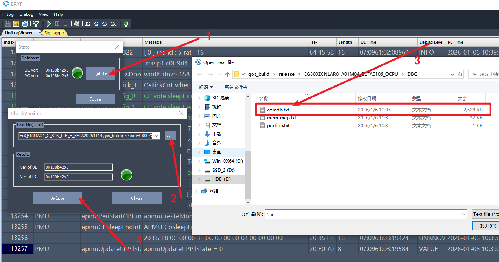

## Pause Log Output

In the UniLogViewer tab, click Stop to stop log recording:

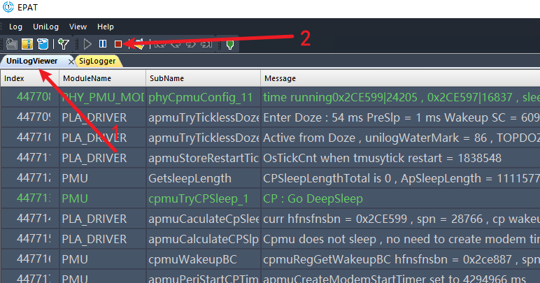

## Search for App Logs

Use Ctrl+F to search for hello world, then click Find Previous to locate the hello world application logs:

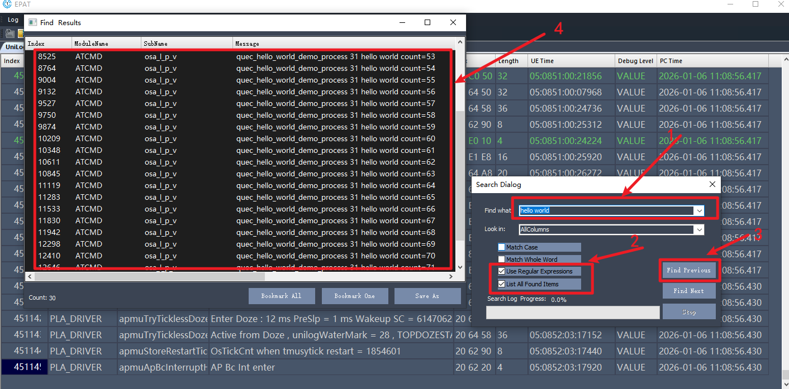