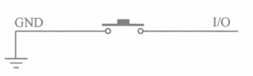

# Button Demo

## Overview

Button Demo is a button interrupt example project based on UNIRTOS. This project demonstrates how to parse GPIO default configurations, switch PINMUX to GPIO functionality, register GPIO interrupt callbacks, and output log counts when button presses are detected on the UNIRTOS platform. Through this example, developers can quickly understand the basic usage of UNIRTOS GPIO interrupt-related APIs.

## **Module Introduction**

The button module is the **most fundamental digital input module**, using tactile switches to implement on/off control and output high/low level signals. It is used to implement **human-computer interaction, switch control, command triggering, counting, and mode switching** functions, making it an essential module for embedded/IoT projects.

**1. Core Parameters**

- Type: Tactile Button (Mechanical)
- Power Supply: 3.3V–5V
- Output: **Digital Signal (High/Low Level)**
- Pins: 3-pin (VCC, GND, SIG)
- Default State: **High Level (Not Pressed)**
- Trigger State: **Low Level (Pressed)**
- Built-in: Pull-up Resistor, Signal Indicator LED

**2. Schematic**



Both VCC and the resistor are inside the chip. When the button is open, the current flowing through the resistor is called sink current, approximately tens of milliamps, so the pin is at high level at this time. When pressed, it connects to ground, producing a low level.

## **Connection Example**

Following the table and images, connect the peripherals to the development board one-to-one correspondingly.

| **Peripheral** | **Module** |
| -------------- | ---------- |
| **KEY (+)**    | 3.3V       |
| **KEY (-)**    | GND        |
| **KEY (S)**    | PIN29      |

## Quick Start

### 1. Development Environment Setup

Refer to the [UNIRTOS Quick Start](https://docs.quectel.com/zh/UniRTOS/UniRTOS%E6%96%87%E6%A1%A3/%E5%BF%AB%E9%80%9F%E4%B8%8A%E6%89%8B/%E5%BF%AB%E9%80%9F%E4%B8%8A%E6%89%8B.html) documentation to learn how to set up the development environment and complete the basic development workflow.

### 2. Code Retrieval

```
# Retrieve the example repository
unirtos-cli new -r unirtos-quecduino-sensor-kit-demos
# Enter the project
cd unirtos-quecduino-sensor-kit-demos-1.0.0/example/02-key_interrupt
```

### 3. Project Structure

```text
02-key_interrupt/
├── CMakeLists.txt      # Button Demo local build configuration
├── env_config.json     # UniRTOS project environment configuration
├── button_demo.c       # Button interrupt example source code
└── README.md           # This file
```

### 4. Build the Project

Retrieve SDK and dependency libraries

```
unirtos-cli env-setup
```

Execute the firmware compilation command in the PowerShell window:

```
unirtos-cli build -m EG800ZCN_LA -v EG800ZCNLAR01A01_OCPU_20260626
```

After compilation completes, the PowerShell window will display the firmware compilation result:

```
SUCCESS: Unirtos project built successfully!
```

### 5. Log Display

After successful initialization, you can see similar output in the logs:

```text
[I/DEMO] button irq demo ready: pin=29 gpio=xx trigger=falling-edge pull-up=on debounce=on
```

After the button is pressed, the example will output the following log each time a valid low-level button press event is detected:

```text
[I/DEMO] button pressed count=1 pin=29 gpio=xx
[I/DEMO] button pressed count=2 pin=29 gpio=xx
[I/DEMO] button pressed count=3 pin=29 gpio=xx
...
```

The GPIO number is parsed from the platform's default PIN configuration and may differ across different platforms.

## Code Overview

### Example Workflow

```text
Program Startup
    ↓
Call button_demo_init()
    ↓
Clear button runtime status
    ↓
Call qosa_get_pin_default_cfg() to parse default PIN/GPIO configuration
    ↓
Call qosa_pin_set_func() to switch PINMUX to GPIO functionality
    ↓
Configure interrupt parameters: pull-up, debounce, user context, callback function
    ↓
Call qosa_interrupt_register() to register interrupt callback
    ↓
Call qosa_interrupt_enable() to enable falling-edge trigger
    ↓
Output ready log, wait for button event
    ↓
After button triggers interrupt, enter button_demo_irq_callback()
    ↓
Read GPIO level and filter invalid triggers
    ↓
After detecting low-level press event, increment count and print log
```

### Main API Interfaces

#### button_demo_init

Button example initialization function.

- Reset interrupt ready flag and button count
- Obtain platform default PIN/GPIO configuration according to BUTTON_DEMO_PIN_NUM
- Switch target pin to GPIO functionality
- Configure GPIO interrupt parameters, including debounce, pull-up, and user context
- Register interrupt callback and enable falling-edge trigger
- Output ready log after initialization completes

#### button_demo_irq_callback

GPIO interrupt callback function.

- Obtain current pin configuration from user context
- Ignore interrupts before module is fully initialized
- Read current GPIO level to avoid misjudgment of invalid triggers
- Only treat low level as valid press event
- Count valid button presses and output log

#### UNIRTOS_APP_EXPORT

Application startup registration macro.

- Register button_demo_init to the application startup process with name button_irq_demo
- Automatically execute initialization logic after system startup without requiring manual task creation

## Configuration Description

The default configuration in the current example is defined in button_demo.c:

- BUTTON_DEMO_PIN_NUM: Default test button pin is QOSA_PIN_29
- Trigger Method: QOSA_GPIO_TRIGGER_FALLING_EDGE
- Pull-up Configuration: QOSA_GPIO_PULL_UP
- Debounce Configuration: QOSA_GPIO_DEBOUNCE_EN
- Startup Order: UNIRTOS_APP_EXPORT(200, "button_irq_demo", button_demo_init)

This example assumes the button hardware pulls GPIO low when pressed, so it uses falling-edge triggering and treats low level as valid press in the callback.

Different platforms may have different PINMUX, GPIO numbering, and external button connection methods. Please adjust BUTTON_DEMO_PIN_NUM and related trigger logic according to your platform's PINMUX table and hardware design.

## Community Forum

[Click here to enter](https://forumschinese.quectel.com/c/66-category/66)

## Contribution Guidelines

We welcome Issue submissions and Pull Requests.
