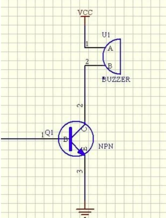

# Beep Demo

## 概述

Beep Demo 是一个基于 UniRTOS 的蜂鸣器驱动示例项目。该项目演示了如何在 UniRTOS 平台上查询 GPIO 默认配置、完成 PINMUX 切换、初始化 GPIO 输出方向，并通过后台任务周期性拉高或拉低控制电平驱动蜂鸣器鸣叫。通过此示例，开发者可以快速了解 UniRTOS GPIO、PINCTRL 和任务 API 的基本使用方法。

## **模块介绍**

用 Arduino 可以完成的互动作品有很多，最常见也最常用的就是声光展示了，前面一直都 是在用 LED 小灯在做实验，本个实验就让大家的电路发出声音，能够发出声音的最常见的 元器件就是蜂鸣器和喇叭了，两者相比较蜂鸣器更简单和易用所以我们本实验采用蜂鸣器。

**蜂鸣器及其原理** 

（一）蜂鸣器的介绍 

​	1．蜂鸣器的作用 蜂鸣器是一种一体化结构的电子讯响器，采用直流电压供电，广泛应用于计算机、打印机、复印机、报警器、电子玩具、汽车电子设备、电话机、定时器等 电子产品中作发声器件。

​	 2．蜂鸣器的分类 蜂鸣器主要分为压电式蜂鸣器和电磁式蜂鸣器两种类型。 

​	3．蜂鸣器的电路图形符号 蜂鸣器在电路中用字母“H”或“HA”（旧标准用 “FM”、“LB”、“JD”等）表示。 

（二）蜂鸣器的结构原理

 1．压电式蜂鸣器压电式蜂鸣器主要由多谐振荡器、压电蜂鸣片、阻抗匹配器及共鸣箱、外壳等组成。有的压电式蜂鸣器外壳上还装有发光二极管。 多谐振荡器由晶体管或集成电路构成。当接通电源后（1.5~15V 直流工作电压）,多 谐振荡器起振,输出 1.5~2.5kHZ 的音频信号，阻抗匹配器推动压电蜂鸣片发声。 压电蜂鸣片由锆钛酸铅或铌镁酸铅压电陶瓷材料制成。在陶瓷片的两面镀上银电极 经极化和老化处理后，再与黄铜片或不锈钢片粘在一起。

2．电磁式蜂鸣器 电磁式蜂鸣器由振荡器、电磁线圈、磁铁、振动膜片及外壳等组成。接通电源后，振荡器产生的音频信号电流通过电磁线圈，使电磁线圈产生磁场。振 动膜片在电磁线圈和磁铁的相互作用下，周期性地振动发声。 

**有源蜂鸣器与无源蜂鸣器有什么区别** 

这里的“源”不是指电源。而是指震荡源。 也就是说，有源蜂鸣器内部带震荡源，所以只要一通电就会叫。 而无源内部不带震荡源，所以如果用直流信号无法令其鸣叫。必须用 2K~5K 的方波去 驱动它。 有源蜂鸣器往往比无源的贵，就是因为里面多个震荡电路。 无源蜂鸣器的优点是：1．便宜，2．声音频率可控，可以做出“多来米发索拉西”的效 果。3．在一些特例中，可以和 LED 复用一个控制口 有源蜂鸣器的优点是：程序控制方便。

**发声原理：**



有源蜂鸣器模块低电平触发，通过配置I/O口，给它低电平即可发声。可见电路图如上

## 连接示例

根据表格和图片指导，将外设与开发板一一对应连接

| 外设        | 开发板 |
| ----------- | ------ |
| BUZZER（+） | 3.3V   |
| BUZZER（-） | GND    |
| BUZZER（S） | PIN19  |

## 快速上手

### 1. 开发环境搭建

参考 [UNIRTOS 快速入门](https://docs.quectel.com/zh/UniRTOS/UniRTOS%E6%96%87%E6%A1%A3/%E5%BF%AB%E9%80%9F%E4%B8%8A%E6%89%8B/%E5%BF%AB%E9%80%9F%E4%B8%8A%E6%89%8B.html) 文档，了解如何搭建开发环境并完成基本开发流程。

### 2. 代码拉取

```
# 拉取示例仓库
unirtos-cli new -r unirtos-quecduino-sensor-kit-demos
# 进入该项目
cd unirtos-quecduino-sensor-kit-demos-1.0.0/example/05-buzzer
```

### 3. 项目结构

```text
05-buzzer/
├── CMakeLists.txt      # Beep Demo 局部构建配置
├── env_config.json     # UniRTOS 工程环境配置
├── beep_demo.c         # 蜂鸣器示例源代码
└── README.md           # 本文件
```

### 4. 构建项目

拉取SDK与依赖库

```
unirtos-cli env-setup
```
在 PowerShell 窗口执行固件编译命令：

```
unirtos-cli build -m EG800ZCN_LA -v EG800ZCNLAR01A01_OCPU_20260626
```
等待编译结束后，PowerShell 窗口末尾会提示固件编译结果：

```
SUCCESS: Unirtos project built successfully!
```

### 5. 日志展示

初始化成功后，可在日志中看到类似输出：

```text
[I/LOG_TAG_DEMO] beep demo init finished, pin=19
[I/LOG_TAG_DEMO] beep gpio ready: pin=19 gpio=19 active=1
[I/LOG_TAG_DEMO] beep alarm armed: initial_delay=10 sec, period=10 sec, repeat=3
```

在默认配置下，示例会先等待约 10 秒，然后每隔约 10 秒触发一轮蜂鸣。每轮蜂鸣连续响 3 次，每次鸣叫约 180 ms，两次鸣叫之间间隔约 120 ms。运行过程中可看到如下周期日志：

```text
[I/LOG_TAG_DEMO] beep alarm triggered, cycle=1
[I/LOG_TAG_DEMO] beep alarm triggered, cycle=2
[I/LOG_TAG_DEMO] beep alarm triggered, cycle=3
...
```

## 代码概览

### 示例工作流程

```text
程序启动
    ↓
调用 beep_demo_bootstrap()
    ↓
创建名为 "beep_alarm" 的后台任务
    ↓
进入任务主函数 beep_demo_alarm_task()
    ↓
调用 beep_demo_prepare_gpio()
    ↓
读取默认引脚配置
    ↓
切换引脚复用为 GPIO 功能
    ↓
初始化 GPIO 输出并设置为空闲电平
    ↓
等待初始延时
    ↓
进入周期循环：
  ├─ 记录当前告警周期日志
  ├─ 调用 beep_demo_ring_alarm() 连续鸣叫多次
  └─ 等待下一轮周期到来
```

### 主要 API 接口

#### beep_demo_bootstrap

模块启动入口函数。

- 检查蜂鸣器任务是否已经创建
- 创建后台任务并设置任务栈大小、优先级和任务名
- 在任务创建成功后输出初始化完成日志

#### beep_demo_alarm_task

后台任务处理函数。

- 调用 GPIO 准备函数完成硬件初始化
- 输出当前告警周期配置日志
- 等待初始延时后进入长期循环
- 周期性触发蜂鸣器鸣叫任务

#### beep_demo_prepare_gpio

GPIO 初始化函数。

- 查询目标引脚的默认 GPIO 配置
- 将 PINMUX 切换到 GPIO 功能
- 初始化 GPIO 输出方向、上下拉和默认电平
- 缓存初始化状态，避免重复配置硬件

#### beep_demo_ring_alarm

蜂鸣执行函数。

- 按设定次数循环输出蜂鸣脉冲
- 控制每次鸣叫持续时间和两次鸣叫之间的停顿时间
- 调用底层电平设置函数实现蜂鸣器开关

#### beep_demo_set_level

GPIO 电平设置封装函数。

- 调用 `qosa_gpio_set_level()` 设置输出电平
- 在设置失败时输出错误日志并返回失败状态

## 配置说明

默认蜂鸣器配置定义在 `beep_demo.c` 中，可通过宏进行编译期覆盖：

- `BEEP_DEMO_PIN_NUM`：默认蜂鸣器控制引脚为 `QOSA_PIN_19`
- `BEEP_DEMO_ACTIVE_LEVEL`：默认有效电平为 `QOSA_GPIO_LEVEL_HIGH`
- `BEEP_DEMO_INITIAL_DELAY_SEC`：首次鸣叫前等待 10 秒
- `BEEP_DEMO_PERIOD_SEC`：两轮蜂鸣周期之间间隔 10 秒
- `BEEP_DEMO_BEEP_ON_MS`：每次鸣叫持续 180 ms
- `BEEP_DEMO_BEEP_OFF_MS`：同一轮内两次鸣叫之间停顿 120 ms
- `BEEP_DEMO_RING_REPEAT_COUNT`：每轮连续鸣叫 3 次
- `BEEP_DEMO_TASK_STACK_SIZE`：后台任务栈大小为 2048
- `BEEP_DEMO_TASK_NAME`：后台任务名称为 `beep_alarm`

如果硬件使用低电平触发蜂鸣器，或者蜂鸣器接在其他 GPIO 上，需要根据实际原理图调整引脚号和有效电平配置。不同平台的 PINMUX 默认配置可能存在差异，实际移植时请结合平台 PIN 表确认对应功能号是否正确。

## 论坛社区

[点此进入](https://forumschinese.quectel.com/c/66-category/66)

## 贡献指南

欢迎参与共建，建议按以下方式提交：

- 提交前先执行一次基础验证：env-setup、build、clean。
- 使用清晰的提交说明，描述改动目的、影响范围和验证结果。
- 新增功能或行为变化时，同步更新 README 与相关文档。
- 通过 Issue 或 Pull Request 提交问题修复与功能改进。
