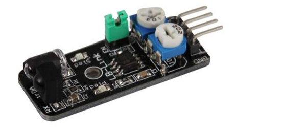

# 障碍物检测模块

## **一、** **模块介绍**

障碍物检测模块是红外反射式数字检测器件，也叫红外避障模块，用于近距离障碍物检测、循迹、避障、限位触发；通过红外发射与接收判断前方是否有障碍物，具备响应快、体积小、3.3V/5V 兼容、GPIO 直读、抗干扰强、寿命长等优点。

**模块组成：**



**工作原理：**

工作原理是红外光 线发射管**发射红外光线**，红外光线接收管**接收红外光线**，当**没有接收到返回的红外光线**时，OUT引脚输出**高电平**，当**接收到返回的红外光线时**，OUT引脚输出**低电平**。

## 二、 连接示例

根据表格和图片指导，将外设与开发板一一对应连接

| 外设      | 开发板       |
| --------- | ------------ |
| 模块（+） | 3.3V         |
| 模块（-） | GND          |
| 模块（S） | PIN4(GPIO31) |


## 三、 驱动代码

```python
from machine import Pin, ExtInt
import utime

# KY-032 引脚说明:
#   VCC: 3.3-5V
#   GND: 接地
#   OUT: 数字输出 (无障碍物=高电平1, 有障碍物=低电平0)
#   EN:  使能引脚 (可选，悬空默认使能)
# 注意: 模块上有两个电位器可调节检测距离和灵敏度

# 配置GPIO为输入，上拉
gpio = Pin(Pin.GPIO31, Pin.IN, Pin.PULL_PU)

# ==================== 轮询模式 ====================
def main_polling():
    print("KY-032 obstacle avoidance sensor (polling mode)")
    while True:
        if gpio.read() == 0:
            print("检测到障碍物")
        else:
            print("无障碍物")
        utime.sleep_ms(200)


# ==================== 中断模式 ====================
obstacle_flag = False

def irq_handler(args):
    global obstacle_flag
    if gpio.read() == 0:
        obstacle_flag = True

def main_interrupt():
    global obstacle_flag
    ext = ExtInt(ExtInt.GPIO31, ExtInt.IRQ_FALLING, ExtInt.PULL_PU, irq_handler)
    ext.enable()
    print("KY-032 obstacle avoidance sensor (interrupt mode)")
    while True:
        if obstacle_flag:
            print("检测到障碍物")
            obstacle_flag = False
        else:
            print("无障碍物")
        utime.sleep_ms(200)


if __name__ == '__main__':
    main_polling()
    # main_interrupt()  # 切换为中断模式

```

 