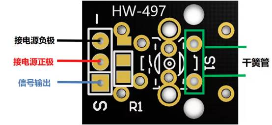

# Mini Magnetic Module

## **Module Introduction**

Mini Magnetic, fully named **Mini Magnetic Reed Switch (Dry Reed Switch Module)**, is a passive switch component that uses magnetic fields to control on/off. This type of magnetic sensing device is generally used as a door/window sensor, position detector, or limit switch trigger. It is now widely used in embedded devices, smart hardware, and maker DIY scenarios. It conducts when a magnetic field approaches and disconnects when the field moves away, with advantages including small size, fast response, no mechanical contact wear, low power consumption, plug-and-play functionality, compatibility with 3.3V/5V low-voltage environments, direct GPIO detection capability, and long service life.

Mini Magnetic Module Composition:



**Working Principle:**

The module is essentially a switch controlled by a magnetic field. When a magnet approaches, the reed blades inside the glass tube become magnetized and mutually attract, causing contact and circuit conduction. When the magnet moves away, the blades lose magnetism and separate due to elasticity, breaking the circuit and implementing magnetic field-triggered switch signal output.

## Connection Example

Following the table and images, connect the peripherals to the development board one-to-one correspondingly.

| Peripheral      | Development Board |
| --------------- | ----------------- |
| Magnetic (+)    | 3.3V              |
| Magnetic (-)    | GND               |
| Magnetic (S)    | PIN23             |
| LED etc (S)     | PIN22             |

## Quick Start

### 1. Development Environment Setup

Refer to the [UNIRTOS Quick Start](https://docs.quectel.com/zh/UniRTOS/UniRTOS%E6%96%87%E6%A1%A3/%E5%BF%AB%E9%80%9F%E4%B8%8A%E6%89%8B/%E5%BF%AB%E9%80%9F%E4%B8%8A%E6%89%8B.html) documentation to learn how to set up the development environment and complete the basic development workflow.

### 2. Code Retrieval

```
# Retrieve the example repository
unirtos-cli new -r unirtos-quecduino-sensor-kit-demos
# Enter the project
cd unirtos-quecduino-sensor-kit-demos-1.0.0/example/09-Mini_Magnetic(KY-021)
```

### 3. Project Structure

```text
09-Mini_Magnetic(KY-021)/
├── CMakeLists.txt      # KY-021 Demo local build configuration
├── env_config.json     # UniRTOS project environment configuration
├── ky021_demo.c        # KY-021 mini magnetic sensor GPIO polling example source code
└── README.md           # This file
```

### 4. Build the Project

Retrieve SDK and dependency libraries

```
unirtos-cli env-setup
```

Execute the firmware compilation command in the PowerShell window:

```
unirtos-cli build -m EG800ZCN_LA -v EG800ZCNLAR01A01_OCPU_20260626
```

After compilation completes, the PowerShell window will display the firmware compilation result:

```
SUCCESS: Unirtos project built successfully!
```

### 5. Log Display

After successful initialization, you can see similar output in the logs:

```text
[I/LOG_TAG_DEMO] KY-021 demo initializing...
[I/LOG_TAG_DEMO] KY-021 demo initialized successfully, sensor_pin=31 output_pin=30
[I/LOG_TAG_DEMO] KY-021 mini magnetic controller started
```

During execution, the example continuously reads GPIO input level in background tasks and outputs current magnetic field detection status on the default 500 ms cycle while controlling the output pin. Typical logs are as follows:

```text
[I/LOG_TAG_DEMO] Detected magnetic field change
[I/LOG_TAG_DEMO] [MiniMagnetic] triggered event
[I/LOG_TAG_DEMO] No magnetic field change detected
[I/LOG_TAG_DEMO] [MiniMagnetic] released event
```

With the default configuration, the status determination rules are as follows:

- `triggered`: Input pin detects low level, magnetic field is detected, output pin is pulled high
- `released`: Input pin is high level, no magnetic field detected, output pin is pulled low

## Code Overview

### Example Workflow

```text
Program Startup
    ↓
Call ky021_demo_init()
    ↓
Configure sensor input pin GPIO31 as pull-up input mode
    ↓
Configure linked output pin GPIO30 as push-pull output mode
    ↓
Create background task named "ky021_task"
    ↓
Enter task main function ky021_task_entry()
    ↓
Read current sensor level and save initial state
    ↓
Enter periodic loop:
  ├─ Call qosa_gpio_get_level() to read sensor input level
  ├─ Call ky021_is_triggered() to determine if trigger level is hit
  ├─ Call ky021_set_output() to control output pin
  ├─ Output "Detected magnetic field change" or "No magnetic field change detected"
  └─ Output triggered or released event log on state change
```

### Main API Interfaces

#### ky021_demo_init

Module startup entry function.

- Check if KY-021 monitoring task is already created
- Initialize sensor input GPIO and linked output GPIO
- Create background task with stack size, priority, and task name
- Output initialization complete log after successful task creation

#### ky021_task_entry

Background task processing function.

- Read current sensor input level as initial state
- Enter long-term loop, periodically poll GPIO input state on fixed cycles
- Determine current magnetic field detection based on trigger level
- Update output pin level for input event linked control
- Output current status log, with event log on state change

#### ky021_gpio_init

GPIO initialization helper function.

- Call `qosa_get_pin_default_cfg()` to obtain target pin default configuration
- Call `qosa_pin_set_func()` to switch pin to GPIO functionality
- Call `qosa_gpio_init()` to complete input or output mode initialization
- Output error log on initialization failure and return failure status

#### ky021_set_output

Output control function.

- Set output pin level based on current sensor trigger status
- Output active level when status is triggered
- Output inactive level when status is not triggered

#### ky021_is_triggered

Status determination function.

- Compare current input level with trigger level
- Return whether currently triggered

#### ky021_get_inactive_level

Output level conversion function.

- Derive inactive level based on configured output active level
- Used for initializing output default state and runtime output control

## Configuration Description

Default KY-021 magnetic reed sensor example configuration is defined in `ky021_demo.c` and can be overridden at compile time through macros:

- `KY021_SENSOR_PIN`: Default sensor input pin is `QOSA_PIN_23`
- `KY021_OUTPUT_PIN`: Default linked output pin is `QOSA_PIN_22`
- `KY021_TRIGGER_LEVEL`: Default trigger level is `QOSA_GPIO_LEVEL_LOW`
- `KY021_OUTPUT_ACTIVE_LEVEL`: Default output active level is `QOSA_GPIO_LEVEL_HIGH`
- `KY021_POLL_INTERVAL_MS`: State polling cycle is 500 ms
- `KY021_TASK_STACK_SIZE`: Background task stack size is 4096
- `KY021_TASK_PRIORITY`: Background task priority is 100
- `KY021_TASK_NAME`: Background task name is `"ky021_task"`

If actual hardware sensor input pin, linked output pin, or trigger level differs from defaults, adjust the above macros according to schematic and measured results. The current example uses GPIO digital input determination, suitable for KY-021 digital output scenarios. If your board design is better suited for reading analog value changes, you can refer to the ADC version of the magnetic reed switch example for extension.

## Community Forum

[Click here to enter](https://forumschinese.quectel.com/c/66-category/66)

## Contribution Guidelines

We welcome Issue submissions and Pull Requests.
