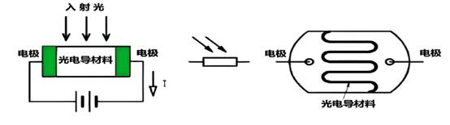

# 光敏电阻模块

## **一、** **模块介绍**

光敏电阻传感器是一种能够将光信号转换为电信号的传感器，其阻值会随着光照强度的变化而改变。在许多实际应用中，如自动照明系统、环境光检测等，光敏电阻传感器发挥着重要作用。 EG800Z Duino开发板具有丰富的外设资源，能够方便地与光敏电阻传感器结合使用，实现对光照强度的检测和处理。

光敏电阻通常由半导体材料制成，其工作原理基于内光电效应。当光线照射到光敏电阻上时，半导体材料中的电子会吸收光子的能量，从价带跃迁到导带，从而使材料的导电能力增强，电阻值降低。反之，当光照强度减弱时，电阻值会增大。

光敏电阻的特性曲线通常呈现出非线性 关系，即光照强度与电阻值之间不是简单的线性比例关系。在实际应用中，需要根据具体的需求和特性曲线来进行校准和处理。

**光敏电阻组成：**


**工作原理：**



**光照越强，电阻越小，电压越低；光照越弱，电阻越大，电压越高。**

## 二、连接示例

根据表格和图片指导，将外设与开发板一一对应连接

| 外设     | 开发板     |
| -------- | ---------- |
| LDR（+） | 3.3V       |
| LDR（-） | GND        |
| LDR（S） | A1（ADC1） |
| LED（S） | PIN 31(10) |

## 快速上手

### 1. 开发环境搭建
参考 [UNIRTOS 快速入门](https://docs.quectel.com/zh/UniRTOS/UniRTOS%E6%96%87%E6%A1%A3/%E5%BF%AB%E9%80%9F%E4%B8%8A%E6%89%8B/%E5%BF%AB%E9%80%9F%E4%B8%8A%E6%89%8B.html) 文档，了解如何搭建开发环境和完成基础开发流程。

### 2. 项目结构

```text
10-photoresistor(KY-018)/
├── CMakeLists.txt      # CMake 构建配置
├── light.c             # KY-018 光敏传感器示例源代码
└── README.md           # 本文件
```

### 3. 构建项目
当前目录中的示例源码和子目录 CMakeLists 已就绪。完成应用接入并使能对应配置后，可在 UniRTOS 根目录执行类似命令进行构建：

```text
unirtos make EG800ZCN_LA EG800ZCNLAR01A01M04_BETA_OCPU_20260511
```

### 4. 日志展示
初始化成功后，可在日志中看到类似输出：

```text
[I/LOG_TAG_DEMO] KY-018 light sensor demo started
[I/LOG_TAG_DEMO] light sensor led init ok, pin=31 gpio=31
[I/LOG_TAG_DEMO] light sensor adc init ok, channel=1 threshold=500mV poll=500ms
[I/LOG_TAG_DEMO] KY-018 light sensor task started
```

运行期间，示例会在后台任务中持续读取 ADC 电压值，并按默认 500 ms 周期输出当前电压、光照状态和 LED 状态。典型日志如下：

```text
[I/LOG_TAG_DEMO] light sensor: voltage=320mV | status=strong_light | led=on
[I/LOG_TAG_DEMO] light sensor: voltage=485mV | status=strong_light | led=on
[I/LOG_TAG_DEMO] light sensor: voltage=760mV | status=weak_light | led=off
```

在默认配置下，状态判定规则如下：

- `strong_light`：ADC 电压值小于 500 mV，认为当前光线较强，同时点亮 LED
- `weak_light`：ADC 电压值大于等于 500 mV，认为当前光线较弱，同时熄灭 LED

## 代码概览

### 示例工作流程

```text
程序启动
    ↓
调用 light_sensor_demo_init()
    ↓
创建名为 "ky018_light" 的后台任务
    ↓
进入任务主函数 light_sensor_demo_task()
    ↓
调用 light_sensor_led_init()
    ↓
配置 LED 对应引脚为 GPIO 输出模式
    ↓
调用 light_sensor_adc_init()
    ↓
设置 ADC 量程档位
    ↓
进入周期循环：
  ├─ 调用 qosa_adc_get_volt() 读取 ADC 电压
  ├─ 与阈值比较判断当前光照强弱
  ├─ 调用 light_sensor_set_led() 控制 LED 亮灭
  └─ 输出当前电压、状态和 LED 日志
```

### 主要 API 接口

#### light_sensor_demo_init
模块启动入口函数。

- 检查光敏传感器监控任务是否已经创建
- 创建后台任务并设置任务栈大小、优先级和任务名
- 在任务创建成功后输出启动日志

#### light_sensor_demo_task
后台任务处理函数。

- 调用 LED 初始化函数完成指示灯 GPIO 配置
- 调用 ADC 初始化函数完成量程配置
- 进入长期循环，按固定周期读取 ADC 电压
- 根据阈值判断当前光照状态并更新 LED
- 输出当前电压、光照状态和 LED 状态日志

#### light_sensor_led_init
LED 初始化函数。

- 调用 `qosa_get_pin_default_cfg()` 获取 LED 引脚默认配置
- 调用 `qosa_pin_set_func()` 将引脚切换到 GPIO 功能
- 调用 `qosa_gpio_init()` 将对应 GPIO 初始化为输出模式
- 在初始化成功后记录 GPIO 编号并输出日志

#### light_sensor_adc_init
ADC 初始化函数。

- 通过 `qosa_adc_ioctl()` 设置目标 ADC 通道的量程档位
- 在初始化成功后输出当前 ADC 通道、阈值和轮询周期配置
- 在配置失败时输出错误日志并返回失败状态

#### light_sensor_set_led
LED 控制函数。

- 根据光照判断结果设置 LED 高低电平
- 当状态为 `strong_light` 时点亮 LED
- 当状态为 `weak_light` 时熄灭 LED

#### light_sensor_status_name
状态判定函数。

- 将当前 ADC 电压值与阈值进行比较
- 返回 `strong_light` 或 `weak_light` 状态字符串

## 配置说明
默认光敏传感器示例配置定义在 `light.c` 中，可通过宏进行编译期覆盖：

- `LIGHT_SENSOR_ADC_CHANNEL`：默认 ADC 通道为 `QOSA_ADC1_CHANNEL`
- `LIGHT_SENSOR_LED_PIN_NUM`：默认 LED 引脚为 `QOSA_PIN_31`
- `LIGHT_SENSOR_THRESHOLD_MV`：默认光照判定阈值为 500 mV
- `LIGHT_SENSOR_ADC_SCALE`：默认 ADC 量程档位为 `QOSA_ADC_SCALE_LEVEL_2`
- `LIGHT_SENSOR_POLL_MS`：光照监控日志输出周期为 500 ms
- `LIGHT_SENSOR_TASK_STACK_SIZE`：后台任务栈大小为 2048

如果实际硬件连接的 ADC 输入通道、LED 引脚或光照阈值与默认值不同，需要根据原理图和实测数据调整上述宏配置。

当前示例采用“电压低表示光照强、电压高表示光照弱”的常见 KY-018 模块特性，并保持演示逻辑为“强光亮灯、弱光灭灯”。如果你的应用场景是自动路灯，可将 LED 控制逻辑改为“弱光亮灯、强光灭灯”。

## 论坛社区
[点此进入](https://forumschinese.quectel.com/c/66-category/66)

## 贡献指南
欢迎提交 Issue 和 Pull Request。