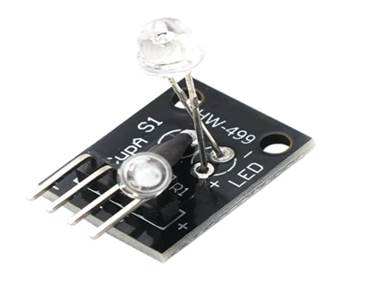

# Magic Aura Module

## **Module Introduction**

The Magic Aura Module (KY-027) is a **two-in-one tilt sensing + LED lighting** digital module featuring a built-in mercury switch and high-brightness LED for tilt detection, attitude triggering, status indication, and maker interactive projects. It features small size, fast response, digital level output, 3.3V/5V compatibility, direct GPIO driving, and stable lifespan.

**Working Principle:**



The module has power, ground, signal output, and LED control terminals. When tilted to a certain angle, the mercury switch conducts/disconnects and outputs high/low levels. The LED brightness can be controlled via GPIO to achieve effects like tilt-activated lighting and attitude alarms.

## Connection Example

Connect peripherals to the development board according to the table and diagram:

| Peripheral | Development Board |
| ------------- | ------ |
| Magic Aura (+) | 3.3V   |
| Magic Aura (-) | GND    |
| Magic Aura (S) | PIN23  |
| Magic Aura (L) | PIN22  |

## Quick Start

### 1. Development Environment Setup

Refer to [UNIRTOS Quick Start](https://docs.quectel.com/zh/UniRTOS/UniRTOS%E6%96%87%E6%A1%A3/%E5%BF%AB%E9%80%9F%E4%B8%8A%E6%89%8B/%E5%BF%AB%E9%80%9F%E4%B8%8A%E6%89%8B.html) documentation to learn how to set up the development environment and complete the basic development workflow.

### 2. Code Repository Cloning

```
# Clone the example repository
unirtos-cli new -r unirtos-quecduino-sensor-kit-demos
# Enter the project
cd unirtos-quecduino-sensor-kit-demos-1.0.0/example/12-Magic_Aura_Module(KY-027)
```

### 3. Project Structure

```text
12-Magic_Aura_Module(KY-027)/
├── CMakeLists.txt      # KY-027 Demo local build configuration
├── env_config.json     # UniRTOS project environment configuration
├── magic_demo.c        # Tilt switch linkage output example source code
├── Kconfig             # Example configuration switch
└── README.md           # This file
```

### 4. Build Project

Fetch SDK and dependencies:

```
unirtos-cli env-setup
```

Execute the firmware compilation command in the PowerShell window:

```
unirtos-cli build -m EG800ZCN_LA -v EG800ZCNLAR01A01_OCPU_20260626
```

After compilation completes, the PowerShell window will display the build result:

```
SUCCESS: Unirtos project built successfully!
```

### 5. Log Display

After successful initialization, you can see similar output in the logs:

```text
[I/LOG_TAG_DEMO] tilt switch demo init done
[I/LOG_TAG_DEMO] tilt switch demo started: sensor pin=23 gpio=23, output pin=22 gpio=22
```

During operation, the example continuously reads GPIO input level in the background task and outputs the current attitude state with a default 1000 ms period. Typical logs are as follows:

```text
[I/LOG_TAG_DEMO] Position normal
[I/LOG_TAG_DEMO] Tilt detected
[I/LOG_TAG_DEMO] Tilt detected
[I/LOG_TAG_DEMO] Position normal
```

Under default configuration, the state judgment rules are as follows:

- `Position normal`: Input pin reads low level, current tilt is not triggered, linkage output is disabled
- `Tilt detected`: Input pin reads high level, current tilt is detected, linkage output is pulled high

## Code Overview

### Example Workflow

```text
Program starts
    ↓
Call magic_halo_demo_init()
    ↓
Initialize tilt switch input GPIO and linkage output GPIO
    ↓
Create background task named "tilt_switch_demo"
    ↓
Enter task main function tilt_switch_demo_task()
    ↓
Enter periodic loop:
  ├─ Call qosa_gpio_get_level() to read tilt switch input level
  ├─ Call tilt_switch_is_tilted() to determine trigger level match
  ├─ Call tilt_switch_set_output() to control linkage output high/low level
  └─ Output current status log
```

### Main API Interfaces

#### magic_halo_demo_init

Module startup entry function.

- Check if tilt switch monitoring task has already been created
- Call `tilt_switch_prepare_gpio()` to initialize input and output pins
- Create background task and set stack size, priority, and task name
- Output startup completion log after task creation succeeds

#### tilt_switch_demo_task

Background task handler function.

- Periodically read tilt switch input GPIO level
- Determine current tilt state based on trigger level
- Update linkage output level based on judgment result
- Output "Tilt detected" or "Position normal" log

#### tilt_switch_prepare_gpio

GPIO initialization function.

- Call `qosa_get_pin_default_cfg()` to get target pin default configuration
- Call `qosa_pin_set_func()` to switch pin to GPIO function
- Call `qosa_gpio_init()` to complete GPIO initialization in input or output mode
- Output error log and return failure status if configuration fails

#### tilt_switch_is_tilted

State judgment function.

- Compare current input level with `TILT_SWITCH_TRIGGER_LEVEL`
- Return current tilt trigger state

#### tilt_switch_set_output

Linkage output control function.

- Set output pin high/low level based on tilt state
- Output valid level when tilt is detected
- Output invalid level when position is normal

#### tilt_switch_get_inactive_level

Output level helper function.

- Derive corresponding invalid level from output valid level
- Reused during output initialization and state switching

## Configuration

Default tilt switch example configuration is defined in `magic_demo.c` and can be overridden at compile time via macros:

- `TILT_SWITCH_SENSOR_PIN`: Default input pin is `QOSA_PIN_23`
- `TILT_SWITCH_OUTPUT_PIN`: Default linkage output pin is `QOSA_PIN_22`
- `TILT_SWITCH_TRIGGER_LEVEL`: Default trigger level is `QOSA_GPIO_LEVEL_HIGH`
- `TILT_SWITCH_OUTPUT_ACTIVE`: Default output valid level is `QOSA_GPIO_LEVEL_HIGH`
- `TILT_SWITCH_POLL_INTERVAL_MS`: Attitude polling and log output period is 1000 ms
- `TILT_SWITCH_TASK_STACK_SIZE`: Background task stack size is 2048

If the actual hardware input pin, linkage output pin, or valid level differs from default values, adjust the above macros based on schematic diagram and measured logic. The current example uses GPIO digital input polling method suitable for quick linkage control of high/low level sensors like tilt switches.

## Community Forum

[Click here](https://forumschinese.quectel.com/c/66-category/66)

## Contribution Guide

Issues and Pull Requests are welcome.
