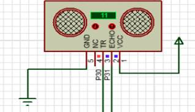
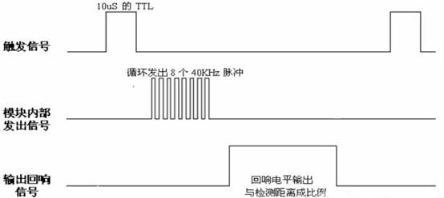

# 超声波模块

## **模块介绍**

HC-SR04 的工作流程由 “触发信号” 启动，通过 “回响信号” 反馈距离，具体步骤如下：

触发测距：STM32 向 Trig 引脚输出至少 10μs 的高电平信号（需高精度延时，笔者在定时器笔记中已实现，可回顾）；

模块自动发送 / 接收超声波：Trig 接收到触发信号后，模块会自动发送 8 个 40kHz 的方波，同时开始检测是否有超声波反射回来；

回响信号反馈：若超声波反射回来，模块会通过 Echo 引脚输出高电平 —— 高电平的持续时间 = 超声波从 “发射到返回” 的总时间；

距离计算：根据 “时间 - 距离” 公式推导，最终距离 = （Echo 高电平持续时间 × 声速） / 2

（注：声速取 340m/s，除以 2 是因为超声波需 “发射→反射→返回”，走了两倍距离）。

**1、核心参数**

- 工作电压：**3.3V–5V**
- 测量范围：**2cm–450cm**
- 分辨率：1mm
- 测量角度：约 15°
- 输出方式：**GPIO / I2C / UART**
- 特点：非接触、精度高、反应快、不受光线颜色影响

**2、原理图**



**3、时序图**



 

## **连接示例**

根据表格指导，将外设与开发板一一对应连接

| **外设**           | **模块** |
| ------------------ | -------- |
| Ultrasonic（+）    | VCC(5V)  |
| Ultrasonic（Trig） | Pin30    |
| Ultrasonic（Echo） | Pin31    |
| Ultrasonic（-）    | GND      |

## 快速上手

### 1. 开发环境搭建

参考 [UNIRTOS 快速入门](https://docs.quectel.com/zh/UniRTOS/UniRTOS%E6%96%87%E6%A1%A3/%E5%BF%AB%E9%80%9F%E4%B8%8A%E6%89%8B/%E5%BF%AB%E9%80%9F%E4%B8%8A%E6%89%8B.html) 文档，了解如何搭建开发环境并完成基本开发流程。

### 2. 代码拉取

```
# 拉取示例仓库
unirtos-cli new -r unirtos-quecduino-sensor-kit-demos
# 进入该项目
cd unirtos-quecduino-sensor-kit-demos-1.0.0/example/14-Ultrasonic_module(HC-SR04)
```

### 3. 项目结构

```text
14-Ultrasonic_module(HC-SR04)/
├── CMakeLists.txt      # HC-SR04 Demo 局部构建配置
├── env_config.json     # UniRTOS 工程环境配置
├── hcsr04_demo.c       # HC-SR04 超声波测距示例源代码
└── README.md           # 本文件
```

### 4. 构建项目

拉取SDK与依赖库

```
unirtos-cli env-setup
```
在 PowerShell 窗口执行固件编译命令：

```
unirtos-cli build -m EG800ZCN_LA -v EG800ZCNLAR01A01_OCPU_20260626
```
等待编译结束后，PowerShell 窗口末尾会提示固件编译结果：

```
SUCCESS: Unirtos project built successfully!
```

### 5. 日志展示

初始化成功后，可在日志中看到类似输出：

```text
[V/LOG_TAG_DEMO] [HC-SR04] enter demo init
[V/LOG_TAG_DEMO] [HC-SR04] init done, trig pin=30 gpio=30, echo pin=31 gpio=31
[V/LOG_TAG_DEMO] [HC-SR04] demo task started
```

运行期间，示例会在后台任务中持续触发 HC-SR04 进行单次测距，并结合滑动窗口均值滤波，在默认 200 ms 周期输出当前距离。典型日志如下：

```text
[V/LOG_TAG_DEMO] [HC-SR04] distance: 23.84 cm
[V/LOG_TAG_DEMO] [HC-SR04] distance: 23.91 cm
[V/LOG_TAG_DEMO] [HC-SR04] distance: 24.03 cm
```

当回波等待超时、脉宽异常或测量结果超出默认量程时，会输出失败日志，例如：

```text
[V/LOG_TAG_DEMO] [HC-SR04] wait echo start timeout
[V/LOG_TAG_DEMO] [HC-SR04] measurement failed
```

在默认配置下，测距规则如下：

- 触发脚先拉低 2 us，再拉高 10 us 触发模块发波
- Echo 高电平脉宽按 `distance_cm = duration_us / 58.0` 换算距离
- 仅保留 2 cm 到 800 cm 的有效测量结果
- 连续 5 次有效测量做滑动窗口均值滤波

## 代码概览

### 示例工作流程

```text
程序启动
    ↓
调用 hcsr04_demo_init()
    ↓
创建名为 "hcsr04_demo" 的后台任务
    ↓
进入任务主函数 hcsr04_demo_process()
    ↓
调用 hcsr04_gpio_init()
    ↓
配置 Trig 引脚为 GPIO 输出、Echo 引脚为 GPIO 输入
    ↓
进入周期循环：
  ├─ 调用 hcsr04_read_filtered_distance()
  ├─ 内部先调用 hcsr04_read_distance() 进行单次测距
  ├─ 调用 hcsr04_trigger() 发送 Trig 触发脉冲
  ├─ 轮询 Echo 高低电平并统计高电平持续时间
  ├─ 按公式换算厘米值并进行有效范围校验
  └─ 将最近有效结果做滑动均值后输出距离日志
```

### 主要 API 接口

#### hcsr04_demo_init

模块启动入口函数。

- 检查超声波测距任务是否已经创建
- 创建后台任务并设置任务栈大小、优先级和任务名
- 在初始化阶段输出启动日志

#### hcsr04_demo_process

后台任务处理函数。

- 调用 GPIO 初始化函数完成 Trig 和 Echo 引脚配置
- 进入长期循环，按固定周期执行测距
- 读取滤波后的距离值并输出日志
- 在测量失败时输出异常提示日志

#### hcsr04_gpio_init

GPIO 初始化函数。

- 调用 `qosa_get_pin_default_cfg()` 获取 Trig 和 Echo 默认引脚配置
- 调用 `qosa_pin_set_func()` 将目标引脚切换到 GPIO 功能
- 调用 `qosa_gpio_init()` 分别初始化输出型 Trig 和输入型 Echo
- 在初始化成功后输出引脚编号和 GPIO 编号日志

#### hcsr04_trigger

触发脉冲发送函数。

- 先将 Trig 拉低，保证触发前总线稳定
- 延时 2 us 后拉高 Trig
- 保持 10 us 高电平后拉低，完成一次触发

#### hcsr04_read_distance

单次测距函数。

- 调用 `hcsr04_trigger()` 发送触发脉冲
- 轮询 Echo 引脚等待高电平开始，并做起始超时保护
- 持续统计 Echo 高电平持续时间，并做结束超时保护
- 按 `duration_us / 58.0` 公式换算距离，单位为 cm

#### hcsr04_read_filtered_distance

滑动窗口滤波函数。

- 调用 `hcsr04_read_distance()` 获取单次原始距离
- 过滤掉超出 2 cm 到 800 cm 量程的无效结果
- 将最近有效距离写入长度为 5 的历史窗口
- 计算窗口均值并输出滤波后的距离结果

## 配置说明

默认 HC-SR04 示例配置定义在 `hcsr04_demo.c` 中，可通过宏进行编译期覆盖：

- `HC_SR04_TRIG_PIN_NUM`：默认 Trig 引脚为 30
- `HC_SR04_ECHO_PIN_NUM`：默认 Echo 引脚为 31
- `HCSR04_TRIGGER_PRE_DELAY_US`：触发前低电平保持时间为 2 us
- `HCSR04_TRIGGER_PULSE_WIDTH_US`：Trig 高电平脉宽为 10 us
- `HCSR04_ECHO_START_TIMEOUT_US`：等待 Echo 拉高超时计数为 30000
- `HCSR04_ECHO_END_TIMEOUT_US`：等待 Echo 拉低超时计数为 500000
- `HCSR04_FILTER_SIZE`：滑动窗口滤波长度为 5
- `HCSR04_VALID_MIN_CM`：默认最小有效距离为 2 cm
- `HCSR04_VALID_MAX_CM`：默认最大有效距离为 800 cm
- `HCSR04_DISTANCE_DIVISOR`：距离换算系数为 58.0
- `HCSR04_MEASUREMENT_INTERVAL_MS`：测距日志输出周期为 200 ms
- `HCSR04_TASK_STACK_SIZE`：后台任务栈大小为 2048

如果实际硬件连接的 Trig/Echo 引脚与默认值不同，或者传感器安装环境导致回波时间偏移、量程上限变化，需要根据原理图和实测结果调整上述宏配置。当前示例采用忙等方式统计 Echo 高电平宽度，适合快速验证 HC-SR04 基本测距能力；如果后续对精度或 CPU 占用有更高要求，可以进一步改为基于硬件定时器或中断捕获的实现。

## 论坛社区

[点此进入](https://forumschinese.quectel.com/c/66-category/66)

## 贡献指南

欢迎参与共建，建议按以下方式提交：

- 提交前先执行一次基础验证：env-setup、build、clean。
- 使用清晰的提交说明，描述改动目的、影响范围和验证结果。
- 新增功能或行为变化时，同步更新 README 与相关文档。
- 通过 Issue 或 Pull Request 提交问题修复与功能改进。
